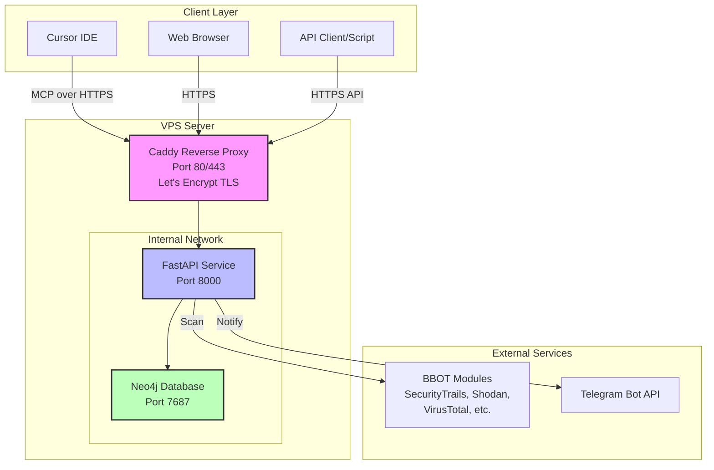
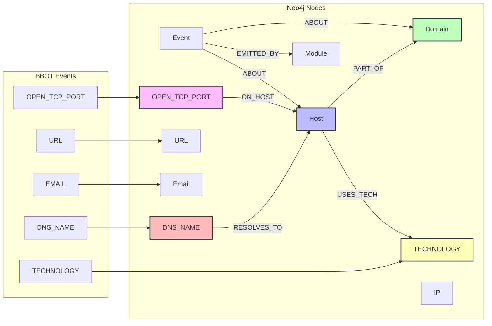

## BBOT OSINT MCP Stack (Docker)

> **English version:** [README_EN.md](README_EN.md)

Triển khai dịch vụ OSINT dựa trên BBOT với API FastAPI, Neo4j để lưu trữ kết quả (kèm timestamp và trạng thái), và MCP server để kết nối từ Cursor.

Tài liệu BBOT tham khảo: [GitHub BBOT](https://github.com/blacklanternsecurity/bbot)

### Mô tả dự án

Hệ thống hóa BBOT thành một dịch vụ OSINT chạy trên VPS: an toàn, có API, Neo4j để lưu dữ liệu đầy đủ (events, host, domain, ip, url, email), MCP server để thao tác từ Cursor. Tối ưu để chạy liên tục với ít luồng, giảm nguy cơ bị chặn.

### Tính năng

- Chạy BBOT với cấu hình "ít luồng" để tránh bị block, cho phép tích hợp API key qua file config.
- Lưu kết quả vào Neo4j, có trường thời gian `last_seen_ts` và `status` cho mỗi `Host`.
- API FastAPI để khởi chạy scan, query kết quả, và upsert dữ liệu từ client.
- MCP server để Cursor có thể kết nối và thực thi công cụ `osint.query`, `osint.scan`, `osint.events.query` an toàn.
- Cleanup sau scan (events quá hạn, host offline quá hạn, orphan nodes) và thông báo Telegram khi xong.
- Hỗ trợ cấu hình đầu vào qua `init_config.json` (targets, API keys module BBOT, Telegram bot).

### Kiến trúc

- `docker-compose.yml`: Neo4j và service OSINT (FastAPI + MCP).
- `init_config.json`: cấu hình đầu vào (targets, API keys, Telegram, tham số scan).
- `services/osint`: mã nguồn API, BBOT runner, MCP server.
- `reverse-proxy/Caddyfile`: cấu hình Caddy với Let's Encrypt tự động.

#### Sơ đồ kiến trúc



#### Luồng dữ liệu Neo4j



---

## Hướng dẫn cài đặt từ đầu (Step-by-Step)

### Yêu cầu

- VPS chạy Ubuntu 22.04 hoặc 24.04
- Domain đã trỏ A-record về IP VPS (ví dụ: `osint.example.com`)
- Quyền root hoặc sudo
- Mở cổng 80 và 443 trên firewall

### Bước 1: Cập nhật hệ thống và cài Docker

SSH vào VPS và chạy:

```bash
# Cập nhật hệ thống
sudo apt-get update -y && sudo apt-get upgrade -y

# Cài các package cần thiết
sudo apt-get install -y ca-certificates curl gnupg lsb-release git

# Thêm Docker GPG key
sudo install -m 0755 -d /etc/apt/keyrings
curl -fsSL https://download.docker.com/linux/ubuntu/gpg \
  | sudo gpg --dearmor -o /etc/apt/keyrings/docker.gpg

# Thêm Docker repository
echo \
  "deb [arch=$(dpkg --print-architecture) signed-by=/etc/apt/keyrings/docker.gpg] \
   https://download.docker.com/linux/ubuntu $(lsb_release -cs) stable" \
  | sudo tee /etc/apt/sources.list.d/docker.list > /dev/null

# Cài Docker và Docker Compose
sudo apt-get update -y
sudo apt-get install -y docker-ce docker-ce-cli containerd.io \
  docker-buildx-plugin docker-compose-plugin

# Bật Docker tự khởi động
sudo systemctl enable --now docker

# Kiểm tra Docker
sudo docker --version
sudo docker compose version
```

### Bước 2: Clone repository

```bash
cd /opt
sudo git clone https://github.com/your-username/bbot-osint-mcp.git
cd bbot-osint-mcp
sudo chown -R $USER:$USER .
```

### Bước 3: Sinh secrets mạnh

```bash
# Chạy script sinh secrets
bash scripts/init-secrets.sh

# Xem thông tin đã sinh (API_TOKEN, Neo4j password)
cat secrets/credentials.txt
```

**Lưu ý**: Ghi nhớ `API_TOKEN` trong file này để dùng khi gọi API và MCP.

### Bước 4: Tạo file cấu hình môi trường

```bash
# Copy file mẫu
cp .env.example .env

# Chỉnh sửa .env
nano .env
```

Điền các giá trị:

```env
# Domain và email cho Let's Encrypt
LE_DOMAIN=osint.example.com
LE_EMAIL=admin@example.com
PUBLIC_BASE_URL=https://osint.example.com

# Neo4j (password sẽ dùng từ secrets/neo4j_password)
NEO4J_USERNAME=neo4j

# Giới hạn rate và concurrency
RATE_LIMIT_PER_MINUTE=120
MAX_CONCURRENT_SCANS=2

# Cleanup policy
CLEANUP_ENABLED=true
EVENT_RETENTION_DAYS=30
OFFLINE_HOST_RETENTION_DAYS=30
ORPHAN_CLEANUP_ENABLED=true

# Telegram (tùy chọn, có thể để trống và điền vào init_config.json)
TELEGRAM_BOT_TOKEN=
TELEGRAM_CHAT_ID=
```

### Bước 5: Cấu hình init_config.json

File này chứa đầu vào cho scan và API keys của các dịch vụ BBOT.

```bash
# Copy file mẫu
cp init_config.json.example init_config.json

# Chỉnh sửa
nano init_config.json
```

**Cấu trúc chi tiết:**

```json
{
  "targets": [
    "evilcorp.com",
    "target2.com"
  ],
  "bbot_modules": {
    "securitytrails": { "api_key": "YOUR_SECURITYTRAILS_KEY" },
    "shodan_dns": { "api_key": "YOUR_SHODAN_KEY" },
    "virustotal": { "api_key": "YOUR_VIRUSTOTAL_KEY" },
    "c99": { "api_key": ["YOUR_C99_KEY_1", "YOUR_C99_KEY_2"] }
  },
  "TELEGRAM_BOT_TOKEN": "123456:ABC-DEF1234ghIkl-zyx57W2v1u123ew11",
  "TELEGRAM_CHAT_ID": "-1001234567890"
}
```

**Giải thích chi tiết:**

1. **targets**: Danh sách domain mục tiêu mặc định. Khi gọi API `/scan` mà không truyền `targets`, sẽ dùng danh sách này.

2. **bbot_modules**: API keys cho các module BBOT:
   - `securitytrails`: Tìm subdomain qua SecurityTrails
   - `shodan_dns`: DNS enumeration qua Shodan
   - `virustotal`: Tìm subdomain và thông tin qua VirusTotal
   - `c99`: Nhiều nguồn OSINT (hỗ trợ nhiều key)
   - Xem thêm modules: [BBOT Modules](https://www.blacklanternsecurity.com/bbot/scanning/configuration/)

3. **TELEGRAM_BOT_TOKEN, TELEGRAM_CHAT_ID**: Để nhận thông báo khi scan xong.
   - Tạo bot: [@BotFather](https://t.me/botfather)
   - Lấy chat_id: [@userinfobot](https://t.me/userinfobot)

**Cấu hình nâng cao scan_defaults:**

Bạn có thể đặt giá trị mặc định cho các tham số scan:

```json
{
  "targets": ["evilcorp.com"],
  "bbot_modules": {
    "securitytrails": { "api_key": "YOUR_KEY" }
  },
  "TELEGRAM_BOT_TOKEN": "",
  "TELEGRAM_CHAT_ID": "",
  
  "scan_defaults": {
    "max_workers": 2,
    "spider_depth": 2,
    "spider_distance": 1,
    "spider_links_per_page": 10,
    "sleep_after_scan_seconds": 120
  }
}
```

**scan_defaults** sẽ tự động áp dụng khi gọi API `/scan` mà không truyền các giá trị này. Nếu truyền rõ trong request, giá trị trong request sẽ được ưu tiên.

### Bước 6: Kiểm tra DNS và Firewall

```bash
# Kiểm tra DNS đã trỏ đúng
dig +short osint.example.com
# Phải trả về IP VPS của bạn

# Kiểm tra firewall (Ubuntu UFW)
sudo ufw allow 80/tcp
sudo ufw allow 443/tcp
sudo ufw allow 22/tcp
sudo ufw enable
sudo ufw status
```

### Bước 7: Khởi chạy stack

```bash
# Build và start containers
sudo docker compose up -d --build

# Theo dõi logs
sudo docker logs -f bbot_caddy
```

**Caddy sẽ tự động:**
- Xin chứng chỉ từ Let's Encrypt
- Cấu hình HTTPS tự động
- Redirect HTTP → HTTPS

Khi thấy log `certificate obtained successfully` là thành công.

### Bước 8: Kiểm tra dịch vụ

```bash
# Lấy API_TOKEN
API_TOKEN=$(grep '^API_TOKEN:' secrets/credentials.txt | awk '{print $2}')

# Test healthcheck
curl -s -H "X-API-Token: $API_TOKEN" "https://osint.example.com/healthz"
# Kết quả: {"status":"ok"}
```

### Bước 9: Chạy scan đầu tiên

```bash
curl -X POST "https://osint.example.com/scan" \
  -H "Content-Type: application/json" \
  -H "X-API-Token: $API_TOKEN" \
  -d '{
    "targets": ["example.com"],
    "presets": ["subdomain-enum"],
    "max_workers": 2,
    "spider_depth": 2,
    "spider_distance": 1,
    "spider_links_per_page": 10,
    "allow_deadly": false,
    "sleep_after_scan_seconds": 60
  }'
```

**Telegram notification**: Nếu đã cấu hình, bạn sẽ nhận tin nhắn khi scan hoàn tất.

---

## Giải thích chi tiết về Cleanup (Dọn dẹp)

### Cleanup hoạt động như thế nào?

**Cleanup KHÔNG xóa toàn bộ dữ liệu**, chỉ xóa:

1. **Events quá hạn**: Events cũ hơn `EVENT_RETENTION_DAYS` (mặc định 30 ngày)
   - Ví dụ: Event scan từ 31 ngày trước sẽ bị xóa
   - **Dữ liệu quan trọng như Host, Domain vẫn được giữ**

2. **Host offline quá hạn**: Host có `status=offline` và `last_seen_ts` cũ hơn `OFFLINE_HOST_RETENTION_DAYS`
   - Chỉ xóa host đã offline quá lâu
   - Host online hoặc mới offline vẫn được giữ

3. **Orphan nodes** (node mồ côi): Nodes không có quan hệ nào
   - Ví dụ: Module không liên kết với Event nào
   - Giúp giữ database gọn gàng

### Cấu hình cleanup

Trong `.env`:

```env
# Bật/tắt cleanup
CLEANUP_ENABLED=true

# Giữ events trong 30 ngày
EVENT_RETENTION_DAYS=30

# Xóa host offline sau 30 ngày
OFFLINE_HOST_RETENTION_DAYS=30

# Xóa nodes mồ côi
ORPHAN_CLEANUP_ENABLED=true
```

**Lưu ý quan trọng:**
- Host **online** và Domain **KHÔNG BAO GIỜ** bị xóa tự động
- Chỉ xóa dữ liệu "rác" và dữ liệu cũ theo chính sách
- Cleanup chạy sau mỗi lần scan

### Ví dụ

Scan lần 1 (ngày 1):
- Thu về 100 subdomains, 1000 events
- Database: 100 hosts, 1000 events

Scan lần 2 (ngày 35):
- Thu về 120 subdomains mới
- Cleanup xóa: 1000 events cũ (>30 ngày), 10 hosts offline (>30 ngày)
- Database sau cleanup: 110 hosts online, 1200 events mới

---

## Sử dụng API

### Các endpoint chính

**1. Healthcheck**

```bash
curl -H "X-API-Token: $API_TOKEN" "https://osint.example.com/healthz"
```

**2. Scan (với tất cả tham số)**

```bash
curl -X POST "https://osint.example.com/scan" \
  -H "Content-Type: application/json" \
  -H "X-API-Token: $API_TOKEN" \
  -d '{
    "targets": ["evilcorp.com"],
    "presets": ["subdomain-enum"],
    "flags": [],
    "max_workers": 2,
    "spider_depth": 2,
    "spider_distance": 1,
    "spider_links_per_page": 10,
    "allow_deadly": false,
    "sleep_after_scan_seconds": 120
  }'
```

**Giải thích tham số:**
- `targets`: Danh sách domain cần scan
- `presets`: Preset BBOT (`subdomain-enum`, `spider`, `web-basic`, v.v.)
- `max_workers`: Số luồng đồng thời (khuyến nghị 2-3)
- `spider_depth`, `spider_distance`, `spider_links_per_page`: Giới hạn web crawling
- `sleep_after_scan_seconds`: Nghỉ sau scan (tránh bị block khi scan liên tục)

**3. Query hosts**

```bash
curl -X POST "https://osint.example.com/query" \
  -H "Content-Type: application/json" \
  -H "X-API-Token: $API_TOKEN" \
  -d '{
    "domain": "evilcorp.com",
    "online_only": true,
    "limit": 100
  }'
```

**4. Query events (full fidelity)**

```bash
curl -X POST "https://osint.example.com/events/query" \
  -H "Content-Type: application/json" \
  -H "X-API-Token: $API_TOKEN" \
  -d '{
    "types": ["DNS_NAME", "URL"],
    "modules": ["subfinder", "httpx"],
    "domain": "evilcorp.com",
    "since_ts": 1729000000,
    "limit": 200
  }'
```

**5. Upsert thủ công**

```bash
curl -X POST "https://osint.example.com/upsert" \
  -H "Content-Type: application/json" \
  -H "X-API-Token: $API_TOKEN" \
  -d '{
    "domain": "evilcorp.com",
    "host": "www.evilcorp.com",
    "status": "online",
    "last_seen_ts": 1730000000,
    "sources": ["manual"],
    "ports": [80, 443]
  }'
```

---

## Tích hợp vào Cursor (MCP Client)

### Bước 1: Cài đặt MCP trong Cursor

1. Mở Cursor Settings
2. Tìm phần MCP configuration
3. Thêm cấu hình server:

```json
{
  "mcpServers": {
    "bbot-osint": {
      "type": "http",
      "url": "https://osint.example.com/mcp",
      "headers": {
        "X-API-Token": "YOUR_API_TOKEN_FROM_SECRETS"
      }
    }
  }
}
```

### Bước 2: Restart MCP client

Trong Cursor:
1. Command Palette (Ctrl+Shift+P / Cmd+Shift+P)
2. Gõ "MCP: Restart"
3. Chọn "MCP: Restart Client"

### Bước 3: Sử dụng tools

Bạn sẽ thấy 3 tools:

1. **osint.query**: Query hosts từ Neo4j
2. **osint.scan**: Khởi chạy scan BBOT
3. **osint.events.query**: Query events chi tiết

**Ví dụ trong Cursor chat:**

```
Call MCP tool: osint.query {"domain":"evilcorp.com","online_only":true}
```

hoặc

```
Call MCP tool: osint.scan {"targets":["evilcorp.com"],"presets":["subdomain-enum"]}
```

---

## Neo4j Data Model

### Nodes

- `Domain {name}`: Domain chính
- `Host {fqdn, status, last_seen_ts, sources, ports}`: Subdomain/host
- `IP {addr}`: Địa chỉ IP
- `URL {value}`: URLs
- `Email {value}`: Email addresses
- `DNS_NAME {name, last_seen_ts}`: DNS records từ BBOT
- `OPEN_TCP_PORT {endpoint, port, host, last_seen_ts}`: Cổng mở (ví dụ: `example.com:443`)
- `TECHNOLOGY {name}`: Công nghệ phát hiện được (ví dụ: `nginx`, `PHP`, `WordPress`)
- `Module {name}`: BBOT modules
- `Event {id, type, ts, raw}`: Events từ BBOT (lưu đầy đủ raw data)

### Relationships

- `(:Host)-[:PART_OF]->(:Domain)`: Host thuộc domain
- `(:DNS_NAME)-[:RESOLVES_TO]->(:Host)`: DNS name resolve tới host
- `(:OPEN_TCP_PORT)-[:ON_HOST]->(:Host)`: Port mở trên host nào
- `(:Host)-[:USES_TECH]->(:TECHNOLOGY)`: Host sử dụng công nghệ gì
- `(:Event)-[:ABOUT]->(:Domain|:Host|:IP|:URL|:Email|:DNS_NAME|:OPEN_TCP_PORT|:TECHNOLOGY)`: Event về entity nào
- `(:Event)-[:EMITTED_BY]->(:Module)`: Event từ module nào

### Truy vấn Neo4j

Truy cập Neo4j Browser: `http://VPS_IP:7474` (chỉ từ localhost, dùng SSH tunnel)

```bash
# SSH tunnel để truy cập Neo4j
ssh -L 7474:localhost:7474 -L 7687:localhost:7687 user@VPS_IP
```

Sau đó mở trình duyệt: `http://localhost:7474`

**Ví dụ queries:**

```cypher
// Tìm tất cả subdomains của evilcorp.com
MATCH (h:Host)-[:PART_OF]->(d:Domain {name: "evilcorp.com"})
WHERE h.status = "online"
RETURN h.fqdn, h.last_seen_ts, h.ports
ORDER BY h.last_seen_ts DESC

// Tìm tất cả open ports của một domain
MATCH (op:OPEN_TCP_PORT)-[:ON_HOST]->(h:Host)-[:PART_OF]->(d:Domain {name: "evilcorp.com"})
RETURN h.fqdn, op.port, op.last_seen_ts
ORDER BY op.port

// Tìm công nghệ được sử dụng
MATCH (h:Host)-[:USES_TECH]->(t:TECHNOLOGY)
WHERE h.fqdn CONTAINS "evilcorp.com"
RETURN h.fqdn, collect(t.name) as technologies

// Tìm DNS records
MATCH (dn:DNS_NAME)-[:RESOLVES_TO]->(h:Host)-[:PART_OF]->(d:Domain {name: "evilcorp.com"})
RETURN dn.name, h.fqdn, dn.last_seen_ts
ORDER BY dn.last_seen_ts DESC

// Tìm events liên quan đến một host
MATCH (ev:Event)-[:ABOUT]->(h:Host {fqdn: "www.evilcorp.com"})
RETURN ev.type, ev.ts, ev.raw
ORDER BY ev.ts DESC
LIMIT 50
```

---

## Bảo mật

### Các biện pháp đã áp dụng

1. **API Token**: Bắt buộc header `X-API-Token` cho mọi endpoint
2. **Docker Secrets**: Credentials lưu trong Docker secrets, không hardcode
3. **Internal Network**: Neo4j chỉ lộ trên mạng nội bộ Docker
4. **HTTPS Only**: Caddy tự động redirect HTTP → HTTPS
5. **Container Hardening**: Read-only filesystem, drop capabilities, no-new-privileges
6. **Rate Limiting**: Giới hạn request per IP

### Khuyến nghị bổ sung

1. **Firewall**: Chỉ mở 80/443 public, SSH qua IP whitelist
2. **VPN**: Truy cập Neo4j và quản trị qua VPN
3. **Monitoring**: Theo dõi logs và cảnh báo 429/401
4. **Secrets Rotation**: Xoay vòng API_TOKEN định kỳ
5. **Backup**: Backup Neo4j data volume thường xuyên

```bash
# Backup Neo4j
sudo docker compose exec neo4j neo4j-admin database dump neo4j \
  --to-path=/data/backups/backup-$(date +%Y%m%d).dump
```

---

## Troubleshooting

### 1. Let's Encrypt không ra cert

**Kiểm tra:**
```bash
# DNS đã trỏ đúng?
dig +short osint.example.com

# Firewall đã mở 80/443?
sudo ufw status

# Logs Caddy
sudo docker logs bbot_caddy
```

**Giải pháp:**
- Đảm bảo DNS trỏ về IP VPS
- Tắt Cloudflare proxy (mây xám) trong quá trình xin cert lần đầu
- Kiểm tra port 80/443 không bị chặn

### 2. API trả về 401 Unauthorized

**Nguyên nhân**: Sai hoặc thiếu `X-API-Token`

**Giải pháp:**
```bash
# Kiểm tra token đúng
cat secrets/credentials.txt | grep API_TOKEN

# Test với token đúng
curl -H "X-API-Token: $(grep '^API_TOKEN:' secrets/credentials.txt | awk '{print $2}')" \
  "https://osint.example.com/healthz"
```

### 3. Scan bị block/rate limit

**Nguyên nhân**: Quét quá nhanh

**Giải pháp:**
- Giảm `max_workers` xuống 1-2
- Tăng `sleep_after_scan_seconds`
- Sử dụng API keys cho các module (trong `init_config.json`)

### 4. Database đầy

**Giải pháp:**
- Giảm `EVENT_RETENTION_DAYS` và `OFFLINE_HOST_RETENTION_DAYS`
- Chạy cleanup thủ công:

```bash
# Vào container
sudo docker exec -it bbot_osint bash

# Python shell
python3 -c "
from app.repository import cleanup_graph
import time
stats = cleanup_graph(int(time.time()))
print(stats)
"
```

---

## Tips vận hành

1. **Xem logs realtime:**
```bash
sudo docker compose logs -f
```

2. **Restart services:**
```bash
sudo docker compose restart osint
```

3. **Update code:**
```bash
git pull
sudo docker compose up -d --build
```

4. **Xem stats Neo4j:**
```cypher
// Trong Neo4j Browser
MATCH (n) RETURN labels(n) as type, count(*) as count
```

5. **Export dữ liệu:**
```bash
# Query và export JSON
curl -X POST "https://osint.example.com/query" \
  -H "Content-Type: application/json" \
  -H "X-API-Token: $API_TOKEN" \
  -d '{"domain":"evilcorp.com","limit":10000}' \
  | jq '.results' > export.json
```

---

**Chúc bạn triển khai thành công!** 🎉

Nếu gặp vấn đề, vui lòng mở issue trên GitHub hoặc liên hệ.
