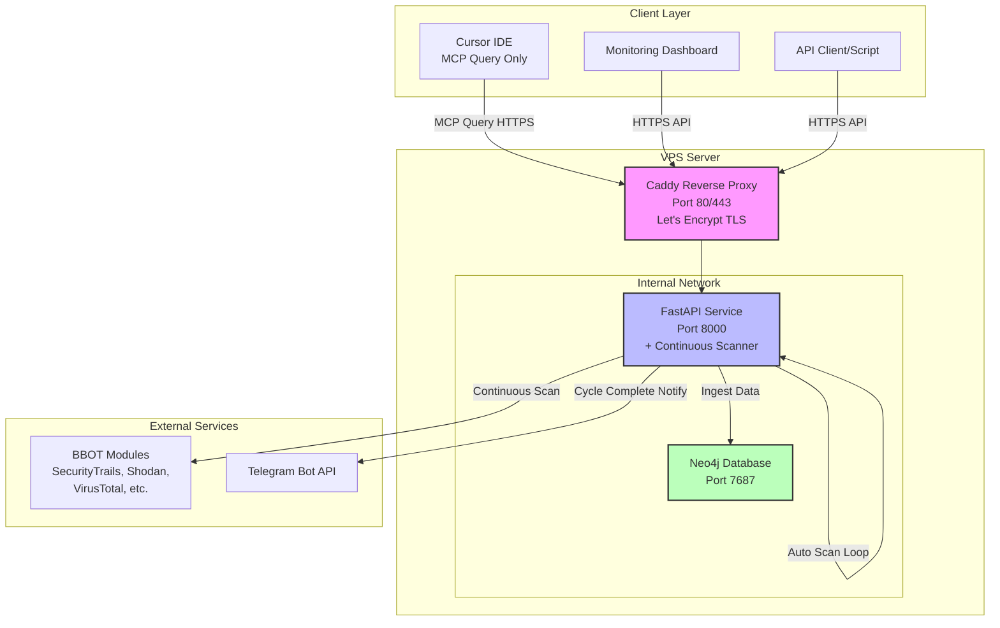
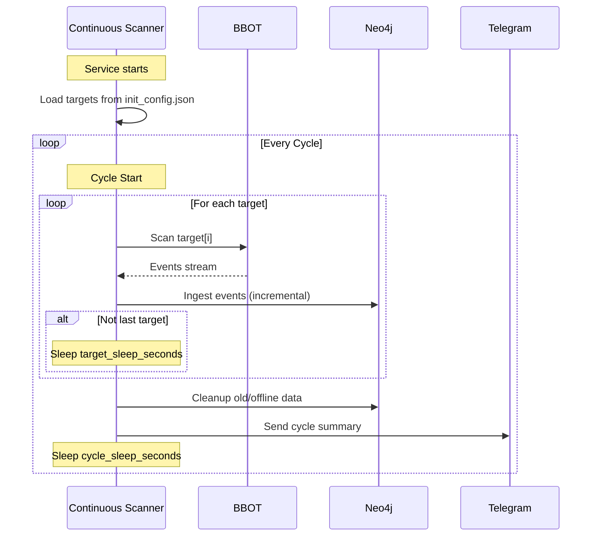
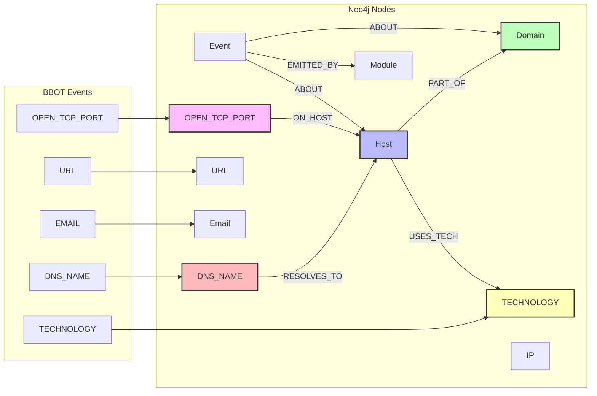
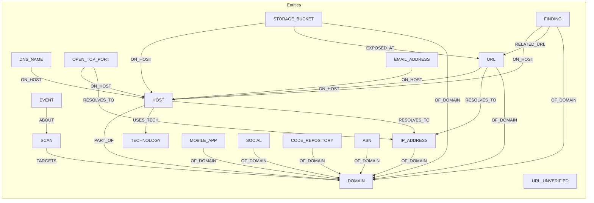

## 1. BBOT OSINT Continuous Monitoring Stack (Docker)

> **English version:** [README_EN.md](README_EN.md)

Hệ thống giám sát OSINT liên tục dựa trên BBOT với FastAPI, Neo4j để lưu trữ kết quả đầy đủ, và MCP server để query từ Cursor.

**GitHub Repository:** [https://github.com/dn9uy3n/bbot-osint-mcp](https://github.com/dn9uy3n/bbot-osint-mcp)

**Tài liệu tham khảo:**
- [GitHub BBOT](https://github.com/blacklanternsecurity/bbot)
- **[📝 Hướng dẫn viết init_config.json](docs/INIT_CONFIG_GUIDE.md)** ⭐
- [Hướng dẫn cài đặt chi tiết](docs/INSTALLATION.md)
  - Cài đặt nhanh: chạy `./scripts/quick-install.sh` (thiết lập DNS Docker, tạo thư mục runtime, sinh secrets, build & up)
### 1.1 Cài đặt nhanh (Quick Install)

```bash
cd /opt
sudo git clone https://github.com/dn9uy3n/bbot-osint-mcp.git
cd bbot-osint-mcp

# (tuỳ chọn) đặt sẵn file init_config.json của bạn vào thư mục repo
# nano init_config.json

chmod +x scripts/quick-install.sh
./scripts/quick-install.sh

# Kiểm tra logs
sudo docker logs -f bbot_osint
```

Script sẽ:
- Thiết lập DNS cho Docker daemon (1.1.1.1, 8.8.8.8) để tránh lỗi name resolution
- Tạo thư mục runtime: `logs/`, `cache/`, `scans/`, `secrets/`
- Sinh secrets nếu thiếu (API_TOKEN, Neo4j password)
- Build và khởi động toàn bộ stack

- [Hướng dẫn sử dụng API](docs/API_USAGE.md)
- [Tích hợp Cursor MCP](docs/MCP_INTEGRATION.md)
- [Mô hình dữ liệu (Data Model)](docs/DATA_MODEL.md)
- [Importer (đọc output.json)](docs/IMPORTER.md)
- [Triển khai phân tán đa VPS](docs/DISTRIBUTED.md)
- [Giải thích Sleep Parameters](SLEEP_PARAMETERS.md)
- [Troubleshooting](docs/TROUBLESHOOTING.md)
- [Quản lý & Gỡ cài đặt](docs/UNINSTALL.md)

### 1.2 Mô tả dự án

Hệ thống **continuous monitoring** tự động quét targets theo chu kỳ, lưu dữ liệu đầy đủ vào Neo4j (DNS records, open ports, technologies, events), với API và MCP để query. Tối ưu để chạy 24/7 với ít luồng, giảm nguy cơ bị chặn.

### 1.3 Tính năng chính

- **Automatic Continuous Scanning**: Tự động quét tất cả targets theo chu kỳ được cấu hình, không cần trigger thủ công.
- **2 loại Sleep Time**:
  - `target_sleep_seconds`: Nghỉ giữa mỗi target trong cùng chu kỳ (tránh quét liên tục).
  - `cycle_sleep_seconds`: Nghỉ sau khi quét xong tất cả targets trước khi bắt đầu chu kỳ mới.
- **Full Data Fidelity**: Lưu đầy đủ dữ liệu BBOT vào Neo4j (DNS_NAME, OPEN_TCP_PORT, TECHNOLOGY, Event raw data).
- **Incremental Updates**: Các lần quét sau chỉ cập nhật/thêm mới, không xóa dữ liệu cũ (trừ cleanup theo retention policy).
- **MCP Query Interface**: Cursor có thể kết nối qua MCP để query dữ liệu (`osint.query`, `osint.events.query`, `osint.status`).
  - Đường dẫn shim hiện tại: `/mcp/tools/osint.query`, `/mcp/tools/osint.events.query`, `/mcp/tools/osint.status`.
- **REST API**: Query hosts và events qua HTTP API.
- **Automatic Cleanup**: Xóa events quá hạn, hosts offline lâu, và orphan nodes sau mỗi chu kỳ.
- **Telegram Notifications**: Thông báo sau mỗi chu kỳ quét hoàn thành.
- **Centralized Configuration**: Tất cả cấu hình trong `init_config.json` (targets, API keys, sleep times).
- **Distributed Workers**: Hỗ trợ nhiều worker BBOT chạy trên các VPS khác nhau, gom dữ liệu qua endpoint `/ingest/output` với token riêng; worker có thể auto-upload ngay sau mỗi lần quét.

### 1.4 Kiến trúc

- `docker-compose.yml`: Neo4j và service OSINT (FastAPI + MCP).
- `init_config.json`: cấu hình đầu vào (targets, API keys, Telegram, tham số scan).
- `services/osint`: mã nguồn API, BBOT runner, MCP server.
- `reverse-proxy/Caddyfile`: cấu hình Caddy với Let's Encrypt tự động.

#### Sơ đồ kiến trúc



#### Continuous Monitoring Flow



#### Luồng dữ liệu Neo4j



---

## 2. Hướng dẫn cài đặt từ đầu (Step-by-Step)

### 2.1 Chuẩn bị chung (áp dụng cho mọi node)

#### 2.1.1 Yêu cầu hạ tầng

- VPS Ubuntu 22.04/24.04 (tối thiểu 2 vCPU, 4 GB RAM khuyến nghị)
- Quyền `sudo`
- Máy chủ trung tâm cần domain đã trỏ A-record về IP (ví dụ: `osint.example.com`)
- Cổng mạng mở theo vai trò:
  - Central: 80/443 (reverse proxy) và 8000 (tùy chọn nếu truy cập trực tiếp API)
  - Worker: chỉ cần 22/8000 hoặc port nội bộ tùy chính sách

#### 2.1.2 Cập nhật hệ thống và cài Docker

```bash
sudo apt-get update -y && sudo apt-get upgrade -y
sudo apt-get install -y ca-certificates curl gnupg lsb-release git

sudo install -m 0755 -d /etc/apt/keyrings
curl -fsSL https://download.docker.com/linux/ubuntu/gpg \
  | sudo gpg --dearmor -o /etc/apt/keyrings/docker.gpg

echo \
  "deb [arch=$(dpkg --print-architecture) signed-by=/etc/apt/keyrings/docker.gpg] \
   https://download.docker.com/linux/ubuntu $(lsb_release -cs) stable" \
  | sudo tee /etc/apt/sources.list.d/docker.list > /dev/null

sudo apt-get update -y
sudo apt-get install -y docker-ce docker-ce-cli containerd.io \
  docker-buildx-plugin docker-compose-plugin

sudo systemctl enable --now docker
sudo docker --version
sudo docker compose version
```

#### 2.1.3 Clone repository

```bash
cd /opt
sudo git clone https://github.com/your-username/bbot-osint-mcp.git
cd bbot-osint-mcp
sudo chown -R $USER:$USER .
```

#### 2.1.4 Sinh secrets mạnh

```bash
bash scripts/init-secrets.sh
cat secrets/credentials.txt
```

Lưu lại `API_TOKEN` và `NEO4J_PASSWORD` để cấu hình ở các bước tiếp theo.

### 2.2 Triển khai trung tâm (central, có domain)

#### 2.2.1 Tạo file `.env` cho central

```bash
cp .env.example .env
nano .env
```

Các biến bắt buộc:

```env
LE_DOMAIN=osint.example.com
LE_EMAIL=admin@example.com
PUBLIC_BASE_URL=https://osint.example.com
NEO4J_USERNAME=neo4j
RATE_LIMIT_PER_MINUTE=120
MAX_CONCURRENT_SCANS=2
CLEANUP_ENABLED=true
EVENT_RETENTION_DAYS=30
OFFLINE_HOST_RETENTION_DAYS=30
ORPHAN_CLEANUP_ENABLED=true
```

- `API_TOKEN` và `NEO4J_PASSWORD` sẽ được Docker secrets tự đọc từ thư mục `secrets/`.
- Có thể thêm `TELEGRAM_BOT_TOKEN` / `TELEGRAM_CHAT_ID` nếu muốn nhận thông báo.

#### 2.2.2 Cấu hình `init_config.json` cho central

```bash
cp init_config.json.example init_config.json
nano init_config.json
```

```json
{
  "targets": ["evilcorp.com", "target2.com"],
  "deployment_role": "central",
  "scan_defaults": {
    "presets": ["subdomain-enum"],
    "flags": ["safe"],
    "max_workers": 2,
    "target_sleep_seconds": 300,
    "cycle_sleep_seconds": 3600
  },
  "bbot_modules": {
    "securitytrails": { "api_key": "YOUR_SECURITYTRAILS_KEY" },
    "shodan_dns": { "api_key": "YOUR_SHODAN_KEY" },
    "virustotal": { "api_key": "YOUR_VIRUSTOTAL_KEY" }
  },
  "workers": [
    { "id": "worker-hcm", "token": "<chuỗi-ngẫu-nhiên-64-bytes>" },
    { "id": "worker-hn", "token": "<chuỗi-khác>" }
  ]
}
```

- `workers` là danh sách cho phép upload từ các worker.
- Token nên ≥64 ký tự (hex/base64). Khi thu hồi quyền, chỉ cần xóa entry tương ứng rồi `docker compose restart osint`.

#### 2.2.3 Khởi động stack central & mở firewall

```bash
sudo ufw allow 80/tcp
sudo ufw allow 443/tcp
sudo ufw allow 22/tcp
sudo ufw allow 8000/tcp comment 'bbot-osint API (tùy chọn)'
sudo ufw enable
sudo ufw status

sudo docker compose up -d --build
sudo docker logs -f bbot_caddy
```

- Caddy sẽ tự xin chứng chỉ Let's Encrypt cho `LE_DOMAIN`.
- Đợi log `certificate obtained successfully` để xác nhận HTTPS hoạt động.

#### 2.2.4 Kiểm tra dịch vụ trung tâm

```bash
API_TOKEN=$(grep '^API_TOKEN:' secrets/credentials.txt | awk '{print $2}')

curl -s -H "X-API-Token: $API_TOKEN" https://osint.example.com/healthz
curl -s -H "X-API-Token: $API_TOKEN" https://osint.example.com/status
```

Ngoài ra có thể theo dõi tiến trình quét:

```bash
sudo docker logs -f bbot_osint
```

### 2.3 Triển khai worker (không cần domain)

#### 2.3.1 Chuẩn bị `.env` tối giản

```bash
cp .env.example .env
nano .env
```

- Để trống `LE_DOMAIN` và `LE_EMAIL` hoặc comment hai dòng này.
- `PUBLIC_BASE_URL` có thể để `http://127.0.0.1:8000` (chỉ phục vụ nội bộ).
- Giữ nguyên các thông số giới hạn (rate limit, cleanup) để scheduler hoạt động.

#### 2.3.2 Cấu hình `init_config.json` cho worker

```json
{
  "targets": ["acme.example"],
  "deployment_role": "worker",
  "scan_defaults": {
    "presets": ["subdomain-enum"],
    "flags": ["safe"],
    "max_workers": 2,
    "target_sleep_seconds": 300,
    "cycle_sleep_seconds": 3600
  },
  "central_api": {
    "url": "https://osint.example.com/ingest/output",
    "worker_id": "worker-hcm",
    "worker_token": "<chuỗi-ngẫu-nhiên-64-bytes>",
    "auto_upload": true,
    "compress": true,
    "verify_tls": true,
    "timeout": 180
  }
}
```

- `central_api.url` có thể dùng domain hoặc IP reverse proxy trung tâm.
- Khi cần upload thủ công, đặt `auto_upload` thành `false` rồi dùng CLI `python -m app.worker_ingest ...`.

#### 2.3.3 Khởi chạy container worker

Worker chỉ cần dịch vụ `osint`:

```bash
sudo docker compose up -d --build --no-deps osint
sudo docker logs -f bbot_osint
```

- Các service `neo4j` và `proxy` không cần chạy trên worker.
- Nếu muốn hạn chế tài nguyên: `sudo docker update --cpus 1.5 --memory 2g bbot_osint`.

#### 2.3.4 Xác nhận upload thành công

Trong log `bbot_osint` sẽ xuất hiện dòng:

```
[INFO] Uploaded 4373 records for acme.example from new scan dirs: [...]
```

Trên trung tâm kiểm tra log `bbot_osint` để thấy `Imported N records` cho `worker_id` tương ứng.

### 2.4 Các tham số scan quan trọng

1. **targets**: Danh sách target quét tự động.
2. **target_sleep_seconds** (mặc định 300): nghỉ giữa các target trong cùng chu kỳ.
3. **cycle_sleep_seconds** (mặc định 3600): nghỉ sau khi hoàn thành toàn bộ danh sách.

📖 Xem thêm: [SLEEP_PARAMETERS.md](SLEEP_PARAMETERS.md)

**workers** (chỉ cho trung tâm): cấu hình danh sách được phép upload bằng `init_config.json`.

**central_api** (chỉ cho worker): xác định endpoint, credential và hành vi upload.

### 2.5 Kịch bản cấu hình điển hình

**1. Chỉ dùng máy chủ trung tâm (không có worker)**
- Giữ `deployment_role` là `central` (mặc định nếu không khai báo).
- Bỏ hẳn khóa `workers` hoặc để mảng rỗng nếu không muốn chấp nhận upload từ bên ngoài.
- Scanner nội bộ sẽ quét các target trong `targets`, import trực tiếp vào Neo4j.

**2. Trung tâm + nhiều worker**
- Máy trung tâm: `deployment_role: "central"`, khai báo danh sách `workers` với `id/token` riêng cho từng worker.
- Worker: `deployment_role: "worker"`, cấu hình `central_api` bằng đúng `worker_id/worker_token` tương ứng, bật `auto_upload` để sau mỗi target sẽ tự gọi `/ingest/output`.
- Đảm bảo firewall chỉ cho phép IP worker gọi endpoint trung tâm; token bị lộ có thể xoá khỏi `workers` để vô hiệu.

**3. Worker tạm thời / gửi thủ công**
- `deployment_role: "worker"`, nhưng đặt `central_api.auto_upload = false`.
- Sau khi scan hoàn tất, chạy CLI: `python -m app.worker_ingest --file ... --url ... --worker-id ... --worker-token ... --domain ...` để đẩy dữ liệu bất cứ lúc nào.
- Phù hợp khi cần kiểm soát quy trình gửi hoặc khi worker đang ở môi trường hạn chế.

### 2.6 Preset & Flag (Cập nhật)
- Preset hỗ trợ: `subdomain-enum`, `spider`, `email-enum`, `web-basic`, `cloud-enum`.
- Flag hỗ trợ: `safe`, `active`.
- Preset không hợp lệ sẽ bị bỏ qua và mặc định `subdomain-enum`.
- Flag không hợp lệ sẽ bị loại bỏ tự động.
- Image đã cài sẵn Node.js/JRE/openssl và một số Python deps phổ biến để hỗ trợ modules nặng; container chạy root để cho phép cài deps bổ sung khi cần.

### 2.7 Vô hiệu hóa module từ `init_config.json`
Có thể tắt các module không cần (ví dụ gowitness trên server không cần screenshot):
```json
"bbot_disable_modules": ["gowitness"]
```

### 2.8 Theo dõi quá trình scan

Continuous scanner tự động bắt đầu khi service khởi động (central và worker). Theo dõi logs:

```bash
sudo docker logs -f bbot_osint
# Filter chỉ xem scanner logs
sudo docker logs -f bbot_osint 2>&1 | grep -E "Scanning|Sleep|Cycle"
```

**Output mẫu:**
```
[INFO] === Starting scan cycle at 2025-10-27 14:30:00 ===
[INFO] [1/2] Scanning target: evilcorp.com
[INFO] ✓ Target evilcorp.com completed: 1247 events
[INFO] Sleeping 300s before next target...
[INFO] [2/2] Scanning target: target2.com
[INFO] ✓ Target target2.com completed: 892 events
[INFO] Running cleanup...
[INFO] === Cycle completed in 1534s, total events: 2139 ===
[INFO] Sleeping 3600s until next cycle...
```

**Telegram notification**: Sau mỗi chu kỳ, bạn sẽ nhận tin nhắn tóm tắt.

---

## 3. Giải thích chi tiết về Cleanup (Dọn dẹp)

### Cleanup hoạt động như thế nào?

**Cleanup KHÔNG xóa toàn bộ dữ liệu**, chỉ xóa:

1. **Events quá hạn**: Events cũ hơn `EVENT_RETENTION_DAYS` (mặc định 30 ngày)
   - Ví dụ: Event scan từ 31 ngày trước sẽ bị xóa
   - **Dữ liệu quan trọng như Host, Domain vẫn được giữ**

2. **Host offline quá hạn**: Host có `status=offline` và `last_seen_ts` cũ hơn `OFFLINE_HOST_RETENTION_DAYS`
   - Chỉ xóa host đã offline quá lâu
   - Host online hoặc mới offline vẫn được giữ

3. **Orphan nodes** (node mồ côi): Nodes không có quan hệ nào
   - Ví dụ: Module không liên kết với Event nào
   - Giúp giữ database gọn gàng

### Cấu hình cleanup

Trong `.env`:

```env
# Bật/tắt cleanup
CLEANUP_ENABLED=true

# Giữ events trong 30 ngày
EVENT_RETENTION_DAYS=30

# Xóa host offline sau 30 ngày
OFFLINE_HOST_RETENTION_DAYS=30

# Xóa nodes mồ côi
ORPHAN_CLEANUP_ENABLED=true
```

**Lưu ý quan trọng:**
- Host **online** và Domain **KHÔNG BAO GIỜ** bị xóa tự động
- Chỉ xóa dữ liệu "rác" và dữ liệu cũ theo chính sách
- Cleanup chạy sau mỗi lần scan

### Ví dụ

Scan lần 1 (ngày 1):
- Thu về 100 subdomains, 1000 events
- Database: 100 hosts, 1000 events

Scan lần 2 (ngày 35):
- Thu về 120 subdomains mới
- Cleanup xóa: 1000 events cũ (>30 ngày), 10 hosts offline (>30 ngày)
- Database sau cleanup: 110 hosts online, 1200 events mới

---

## 4. Sử dụng API

### Các endpoint chính

**1. Healthcheck & Status**

```bash
# Kiểm tra service health
curl -H "X-API-Token: $API_TOKEN" "https://osint.example.com/healthz"

# Xem trạng thái scanner chi tiết
curl -H "X-API-Token: $API_TOKEN" "https://osint.example.com/status"
```

**Response mẫu `/status`:**
```json
{
  "scanner_running": true,
  "targets": ["evilcorp.com", "target2.com"],
  "scan_config": {
    "presets": ["subdomain-enum"],
    "max_workers": 2,
    "target_sleep_seconds": 300,
    "cycle_sleep_seconds": 3600
  },
  "cleanup_enabled": true
}
```

**2. Query hosts**

```bash
curl -X POST "https://osint.example.com/query" \
  -H "Content-Type: application/json" \
  -H "X-API-Token: $API_TOKEN" \
  -d '{
    "domain": "evilcorp.com",
    "online_only": true,
    "limit": 100
  }'
```

**3. Query events (full fidelity)**

```bash
curl -X POST "https://osint.example.com/events/query" \
  -H "Content-Type: application/json" \
  -H "X-API-Token: $API_TOKEN" \
  -d '{
    "types": ["DNS_NAME", "OPEN_TCP_PORT", "TECHNOLOGY"],
    "modules": ["subfinder", "httpx"],
    "domain": "evilcorp.com",
    "since_ts": 1729000000,
    "limit": 200
  }'
```

**Lưu ý**: Không có endpoint `/scan` để trigger scan thủ công. Scanner tự động chạy theo chu kỳ với targets trong `init_config.json`.

---

## 5. Tích hợp vào Cursor (MCP Client)

### Bước 1: Cài đặt MCP trong Cursor

1. Mở Cursor Settings
2. Tìm phần MCP configuration
3. Thêm cấu hình server:

```json
{
  "mcpServers": {
    "bbot-osint": {
      "type": "http",
      "url": "http://osint.example.com/mcp",
      "headers": {
        "X-API-Token": "YOUR_API_TOKEN_FROM_SECRETS"
      }
    }
  }
}
```

### Bước 2: Restart MCP client

Trong Cursor:
1. Command Palette (Ctrl+Shift+P / Cmd+Shift+P)
2. Gõ "MCP: Restart"
3. Chọn "MCP: Restart Client"

### Bước 3: Sử dụng tools

Bạn sẽ thấy 3 tools (chỉ để query, không trigger scan):

1. **osint.query**: Query hosts từ Neo4j
2. **osint.events.query**: Query events chi tiết
3. **osint.status**: Xem trạng thái scanner

**Ví dụ trong Cursor chat:**

```
Call MCP tool: osint.query {"domain":"evilcorp.com","online_only":true}
```

```
Call MCP tool: osint.events.query {"types":["DNS_NAME","OPEN_TCP_PORT"],"limit":100}
```

```
Call MCP tool: osint.status {}
```

**Lưu ý**: MCP **KHÔNG có** tool `osint.scan`. Scan tự động chạy theo chu kỳ từ service backend.

---

## 6. Neo4j Data Model

### Nodes

- `Domain {name}`: Domain chính
- `Host {name, status, last_seen_ts, sources, ports}`: Subdomain/host
- `IP_ADDRESS {addr}`: Địa chỉ IP
- `URL {value}`, `URL_UNVERIFIED {value}`: URLs
- `EMAIL_ADDRESS {value}`: Email addresses
- `DNS_NAME {name, last_seen_ts}`: DNS records từ BBOT
- `OPEN_TCP_PORT {endpoint, port, host, last_seen_ts}`: Cổng mở (ví dụ: `example.com:443`)
- `TECHNOLOGY {name}`: Công nghệ phát hiện được (ví dụ: `nginx`, `PHP`, `WordPress`)
- `Module {name}`: BBOT modules
- `Event {id, type, ts, raw}`: Events từ BBOT (lưu đầy đủ raw data)

### Relationships

- `(:Host)-[:PART_OF]->(:Domain)`: Host thuộc domain
- `(:DNS_NAME)-[:ON_HOST]->(:Host)`: DNS name thuộc host
- `(:OPEN_TCP_PORT)-[:ON_HOST]->(:Host)`: Port mở trên host nào
- `(:Host)-[:USES_TECH]->(:TECHNOLOGY)`: Host sử dụng công nghệ gì
- `(:EVENT)-[:ABOUT]->(:Domain|:Host|:IP_ADDRESS|:URL|:URL_UNVERIFIED|:EMAIL_ADDRESS|:DNS_NAME|:OPEN_TCP_PORT|:TECHNOLOGY)`: Event về entity nào
- `(:Event)-[:EMITTED_BY]->(:Module)`: Event từ module nào

### Sơ đồ Mermaid



### Truy vấn Neo4j

Neo4j đã được publish cục bộ trên VPS ở 127.0.0.1:7474 (HTTP) và 127.0.0.1:7687 (Bolt). Truy cập an toàn từ máy local qua SSH Tunnel (không cần chạy socat):

```bash
# Từ máy local
ssh -N -L 7474:127.0.0.1:7474 -L 7687:127.0.0.1:7687 user@VPS_IP
```

Sau đó mở: `http://localhost:7474` (Bolt: `bolt://localhost:7687`)
User: `neo4j`, Password: từ `secrets/neo4j_password`.

**Ví dụ queries:**

```cypher
// Tìm tất cả subdomains của evilcorp.com
MATCH (h:Host)-[:PART_OF]->(d:Domain {name: "evilcorp.com"})
WHERE h.status = "online"
RETURN h.name, h.last_seen_ts, h.ports
ORDER BY h.last_seen_ts DESC

// Tìm tất cả open ports của một domain
MATCH (op:OPEN_TCP_PORT)-[:ON_HOST]->(h:Host)-[:PART_OF]->(d:Domain {name: "evilcorp.com"})
OPTIONAL MATCH (op)-[:RESOLVES_TO]->(i:IP_ADDRESS)
RETURN h.name, op.port, collect(distinct i.addr) AS ips
ORDER BY op.port

// Tìm công nghệ được sử dụng
MATCH (h:Host)-[:USES_TECH]->(t:TECHNOLOGY)
WHERE h.name CONTAINS "evilcorp.com"
RETURN h.name, collect(t.name) as technologies

// Tìm DNS records
MATCH (dn:DNS_NAME)-[:ON_HOST]->(h:Host)-[:PART_OF]->(d:Domain {name: "evilcorp.com"})
RETURN dn.name, h.name, dn.last_seen_ts
ORDER BY dn.last_seen_ts DESC

// Tìm events liên quan đến một host
MATCH (ev:EVENT)-[:ABOUT]->(h:Host {name: "www.evilcorp.com"})
RETURN ev.type, ev.raw
ORDER BY ev.ts DESC
LIMIT 50
```

---

## 7. Bảo mật

### Các biện pháp đã áp dụng

1. **API Token**: Bắt buộc header `X-API-Token` cho mọi endpoint
2. **Docker Secrets**: Credentials lưu trong Docker secrets, không hardcode
3. **Internal Network**: Neo4j chỉ lộ trên mạng nội bộ Docker
4. **HTTPS Only**: Caddy tự động redirect HTTP → HTTPS
5. **Container Hardening**: Read-only filesystem, drop capabilities, no-new-privileges
6. **Rate Limiting**: Giới hạn request per IP

### Khuyến nghị bổ sung

1. **Firewall**: Chỉ mở 80/443 public, SSH qua IP whitelist
2. **VPN**: Truy cập Neo4j và quản trị qua VPN
3. **Monitoring**: Theo dõi logs và cảnh báo 429/401
4. **Secrets Rotation**: Xoay vòng API_TOKEN định kỳ
5. **Backup**: Backup Neo4j data volume thường xuyên

```bash
# Backup Neo4j
sudo docker compose exec neo4j neo4j-admin database dump neo4j \
  --to-path=/data/backups/backup-$(date +%Y%m%d).dump
```

---

## 8. Quản lý và Bảo trì

### Tạm dừng để sửa config

Khi cần thêm targets mới, cập nhật API keys, hoặc thay đổi sleep times:

```bash
cd /opt/bbot-osint-mcp

# Dừng OSINT service
sudo docker compose stop osint

# Sửa config
nano init_config.json

# Khởi động lại
sudo docker compose start osint

# Xem logs
sudo docker logs -f bbot_osint
```

**Hoặc hot reload (không cần stop):**

```bash
# Sửa config trực tiếp
nano init_config.json

# Restart để apply
sudo docker compose restart osint
```

### Các thao tác thường dùng

```bash
# Xem logs realtime
sudo docker logs -f bbot_osint

# Xem chỉ scanner logs
sudo docker logs -f bbot_osint 2>&1 | grep -E "Scanning|Sleep|Cycle"

# Kiểm tra status
curl -H "X-API-Token: $(cat secrets/api_token)" \
  https://osint.example.com/status

# Restart services
sudo docker compose restart osint

# Update code
git pull
sudo docker compose up -d --build

# Xem resource usage
sudo docker stats bbot_osint bbot_neo4j
```

### Backup dữ liệu

```bash
# Backup Neo4j volume
mkdir -p ~/backups
sudo docker run --rm \
  -v bbot-osint-mcp_neo4j_data:/data \
  -v ~/backups:/backup \
  ubuntu tar czf /backup/neo4j-$(date +%Y%m%d).tar.gz /data

# Backup config
cp init_config.json ~/backup-init_config.json
cp secrets/credentials.txt ~/backup-credentials.txt
```

**Chi tiết đầy đủ:** [docs/UNINSTALL.md](docs/UNINSTALL.md) (bao gồm tạm dừng, sửa config, backup, restore)

---

## 9. Gỡ cài đặt

Xem hướng dẫn chi tiết: **[docs/UNINSTALL.md](docs/UNINSTALL.md)**

### Gỡ nhanh (xóa tất cả)

```bash
cd /opt/bbot-osint-mcp
sudo docker compose down -v
sudo docker rmi bbot-osint-mcp-osint:latest neo4j:5.23.1 caddy:2.8-alpine
cd /opt && sudo rm -rf /opt/bbot-osint-mcp
```

### Hoặc dùng script tự động

```bash
cd /opt/bbot-osint-mcp
chmod +x scripts/uninstall.sh
./scripts/uninstall.sh
```

Script cung cấp 3 tùy chọn:
1. Gỡ hoàn toàn (xóa tất cả)
2. Gỡ nhưng giữ dữ liệu (có thể cài lại sau)
3. Chỉ reset database Neo4j

---

## 10. Troubleshooting

### 1. Let's Encrypt không ra cert

**Kiểm tra:**
```bash
# DNS đã trỏ đúng?
dig +short osint.example.com

# Firewall đã mở 80/443?
sudo ufw status

# Logs Caddy
sudo docker logs bbot_caddy
```

**Giải pháp:**
- Đảm bảo DNS trỏ về IP VPS
- Tắt Cloudflare proxy (mây xám) trong quá trình xin cert lần đầu
- Kiểm tra port 80/443 không bị chặn

### 2. API trả về 401 Unauthorized

**Nguyên nhân**: Sai hoặc thiếu `X-API-Token`

**Giải pháp:**
```bash
# Kiểm tra token đúng
cat secrets/credentials.txt | grep API_TOKEN

# Test với token đúng
curl -H "X-API-Token: $(grep '^API_TOKEN:' secrets/credentials.txt | awk '{print $2}')" \
  "https://osint.example.com/healthz"
```

### 3. Scan bị block/rate limit

**Nguyên nhân**: Quét quá nhanh

**Giải pháp:**
- Giảm `max_workers` xuống 1-2
- Tăng `sleep_after_scan_seconds`
- Sử dụng API keys cho các module (trong `init_config.json`)

### 4. Database đầy

**Giải pháp:**
- Giảm `EVENT_RETENTION_DAYS` và `OFFLINE_HOST_RETENTION_DAYS`
- Chạy cleanup thủ công:

```bash
# Vào container
sudo docker exec -it bbot_osint bash

# Python shell
python3 -c "
from app.repository import cleanup_graph
import time
stats = cleanup_graph(int(time.time()))
print(stats)
"
```

---

## 11. Tips vận hành

1. **Xem logs realtime:**
```bash
sudo docker compose logs -f
```

2. **Restart services:**
```bash
sudo docker compose restart osint
```

3. **Update code:**
```bash
git pull
sudo docker compose up -d --build
```

4. **Xem stats Neo4j:**
```cypher
// Trong Neo4j Browser
MATCH (n) RETURN labels(n) as type, count(*) as count
```

5. **Export dữ liệu:**
```bash
# Query và export JSON
curl -X POST "https://osint.example.com/query" \
  -H "Content-Type: application/json" \
  -H "X-API-Token: $API_TOKEN" \
  -d '{"domain":"evilcorp.com","limit":10000}' \
  | jq '.results' > export.json
```

---

**Chúc bạn triển khai thành công!** 🎉

Nếu gặp vấn đề, vui lòng mở issue trên GitHub hoặc liên hệ.
