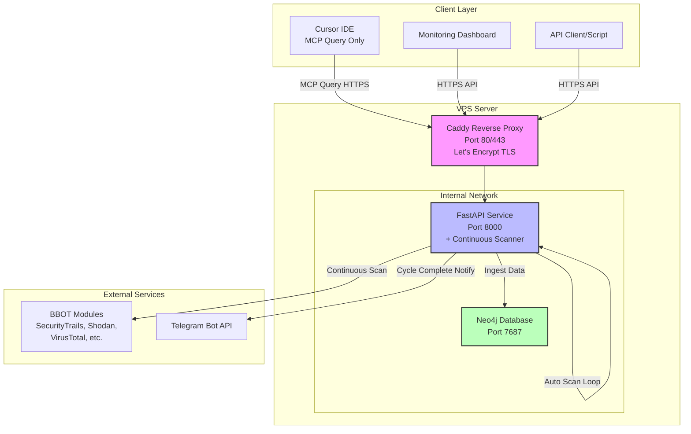
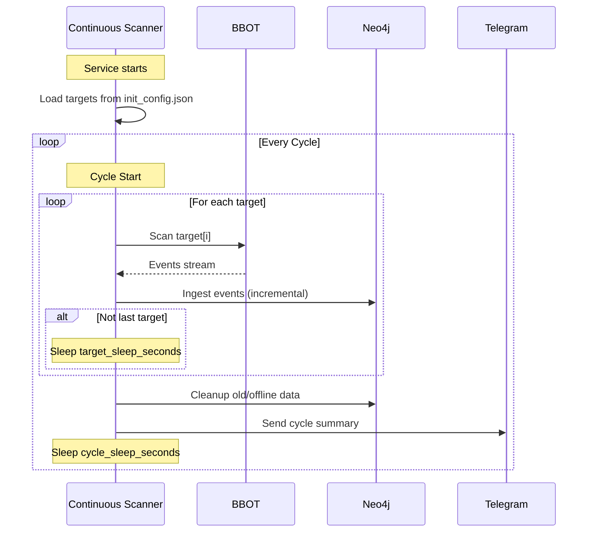
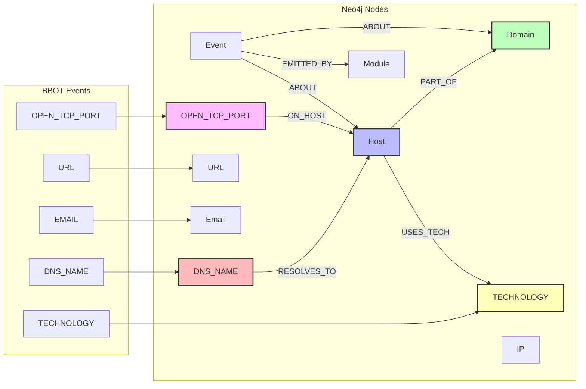

## BBOT OSINT Continuous Monitoring Stack (Docker)

> **Vietnamese version:** [README.md](README.md)

Continuous OSINT monitoring system based on BBOT with FastAPI, Neo4j for full data storage, and MCP server for querying from Cursor.

**GitHub Repository:** [https://github.com/dn9uy3n/bbot-osint-mcp](https://github.com/dn9uy3n/bbot-osint-mcp)

**Documentation:**
- [GitHub BBOT](https://github.com/blacklanternsecurity/bbot)
- **[📝 init_config.json Configuration Guide](docs/INIT_CONFIG_GUIDE.md)** ⭐
- [Detailed Installation Guide](docs/INSTALLATION.md)
- [API Usage Guide](docs/API_USAGE.md)
- [Cursor MCP Integration](docs/MCP_INTEGRATION.md)
- [Neo4j Data Model](docs/NEO4J_MODEL.md)
- [Sleep Parameters Explained](SLEEP_PARAMETERS.md)
- [Troubleshooting](docs/TROUBLESHOOTING.md)
- [Management & Uninstall Guide](docs/UNINSTALL.md)

### Project Description

A **continuous monitoring** system that automatically scans targets in cycles, stores full data in Neo4j (DNS records, open ports, technologies, events), with API and MCP for querying. Optimized for 24/7 operation with low concurrency, reducing risk of being blocked.

### Key Features

- **Automatic Continuous Scanning**: Automatically scans all configured targets in cycles, no manual triggering needed.
- **2 Types of Sleep Time**:
  - `target_sleep_seconds`: Rest between each target within same cycle (avoid continuous scanning).
  - `cycle_sleep_seconds`: Rest after scanning all targets before starting new cycle.
- **Full Data Fidelity**: Store complete BBOT data in Neo4j (DNS_NAME, OPEN_TCP_PORT, TECHNOLOGY, Event raw data).
- **Incremental Updates**: Subsequent scans only update/add new data, never delete old data (except cleanup by retention policy).
- **MCP Query Interface**: Cursor can connect via MCP to query data (`osint.query`, `osint.events.query`, `osint.status`).
- **REST API**: Query hosts and events via HTTP API.
- **Automatic Cleanup**: Delete expired events, long-offline hosts, and orphan nodes after each cycle.
- **Telegram Notifications**: Notification after each completed scan cycle.
- **Centralized Configuration**: All configuration in `init_config.json` (targets, API keys, sleep times).

### Architecture

- `docker-compose.yml`: Neo4j and OSINT service (FastAPI + MCP).
- `init_config.json`: input configuration (targets, API keys, Telegram, scan parameters).
- `services/osint`: API, BBOT runner, MCP server source code.
- `reverse-proxy/Caddyfile`: Caddy configuration with automatic Let's Encrypt.

#### Architecture Diagram



#### Continuous Monitoring Flow



#### Neo4j Data Flow



---

## Step-by-Step Installation Guide

### Requirements

- VPS running Ubuntu 22.04 or 24.04
- Domain with A-record pointing to VPS IP (e.g., `osint.example.com`)
- Root or sudo access
- Ports 80 and 443 open on firewall

### Step 1: Update System and Install Docker

SSH into your VPS and run:

```bash
# Update system
sudo apt-get update -y && sudo apt-get upgrade -y

# Install required packages
sudo apt-get install -y ca-certificates curl gnupg lsb-release git

# Add Docker GPG key
sudo install -m 0755 -d /etc/apt/keyrings
curl -fsSL https://download.docker.com/linux/ubuntu/gpg \
  | sudo gpg --dearmor -o /etc/apt/keyrings/docker.gpg

# Add Docker repository
echo \
  "deb [arch=$(dpkg --print-architecture) signed-by=/etc/apt/keyrings/docker.gpg] \
   https://download.docker.com/linux/ubuntu $(lsb_release -cs) stable" \
  | sudo tee /etc/apt/sources.list.d/docker.list > /dev/null

# Install Docker and Docker Compose
sudo apt-get update -y
sudo apt-get install -y docker-ce docker-ce-cli containerd.io \
  docker-buildx-plugin docker-compose-plugin

# Enable Docker on boot
sudo systemctl enable --now docker

# Verify installation
sudo docker --version
sudo docker compose version
```

### Step 2: Clone Repository

```bash
cd /opt
sudo git clone https://github.com/your-username/bbot-osint-mcp.git
cd bbot-osint-mcp
sudo chown -R $USER:$USER .
```

### Step 3: Generate Strong Secrets

```bash
# Run secret generation script
bash scripts/init-secrets.sh

# View generated credentials (API_TOKEN, Neo4j password)
cat secrets/credentials.txt
```

**Note**: Save the `API_TOKEN` from this file for API and MCP calls.

### Step 4: Create Environment Configuration

```bash
# Copy example file
cp .env.example .env

# Edit .env
nano .env
```

Fill in values:

```env
# Domain and email for Let's Encrypt
LE_DOMAIN=osint.example.com
LE_EMAIL=admin@example.com
PUBLIC_BASE_URL=https://osint.example.com

# Neo4j (password from secrets/neo4j_password)
NEO4J_USERNAME=neo4j

# Rate limit and concurrency
RATE_LIMIT_PER_MINUTE=120
MAX_CONCURRENT_SCANS=2

# Cleanup policy
CLEANUP_ENABLED=true
EVENT_RETENTION_DAYS=30
OFFLINE_HOST_RETENTION_DAYS=30
ORPHAN_CLEANUP_ENABLED=true

# Telegram (optional, can leave empty and fill in init_config.json)
TELEGRAM_BOT_TOKEN=
TELEGRAM_CHAT_ID=
```

### Step 5: Configure init_config.json

This file contains scan inputs and BBOT service API keys.

```bash
# Copy example file
cp init_config.json.example init_config.json

# Edit configuration
nano init_config.json
```

**Detailed Structure:**

```json
{
  "targets": [
    "evilcorp.com",
    "target2.com"
  ],
  "bbot_modules": {
    "securitytrails": { "api_key": "YOUR_SECURITYTRAILS_KEY" },
    "shodan_dns": { "api_key": "YOUR_SHODAN_KEY" },
    "virustotal": { "api_key": "YOUR_VIRUSTOTAL_KEY" },
    "c99": { "api_key": ["YOUR_C99_KEY_1", "YOUR_C99_KEY_2"] }
  },
  "TELEGRAM_BOT_TOKEN": "123456:ABC-DEF1234ghIkl-zyx57W2v1u123ew11",
  "TELEGRAM_CHAT_ID": "-1001234567890"
}
```

**Detailed Explanation:**

1. **targets**: Default target domain list used by the continuous scanner.

2. **bbot_modules**: API keys for BBOT modules:
   - `securitytrails`: Find subdomains via SecurityTrails
   - `shodan_dns`: DNS enumeration via Shodan
   - `virustotal`: Find subdomains and info via VirusTotal
   - `c99`: Multiple OSINT sources (supports multiple keys)
   - See more modules: [BBOT Modules](https://www.blacklanternsecurity.com/bbot/scanning/configuration/)

3. **TELEGRAM_BOT_TOKEN, TELEGRAM_CHAT_ID**: To receive notifications when scan completes.
   - Create bot: [@BotFather](https://t.me/botfather)
   - Get chat_id: [@userinfobot](https://t.me/userinfobot)

**scan_defaults Configuration (Important!):**

```json
{
  "targets": ["evilcorp.com", "target2.com"],
  "bbot_modules": {
    "securitytrails": { "api_key": "YOUR_KEY" }
  },
  "TELEGRAM_BOT_TOKEN": "123456:ABC-DEF...",
  "TELEGRAM_CHAT_ID": "-1001234567890",
  
  "scan_defaults": {
    "presets": ["subdomain-enum"],
    "flags": [],
    "max_workers": 2,
    "spider_depth": 2,
    "spider_distance": 1,
    "spider_links_per_page": 10,
    "allow_deadly": false,
    "target_sleep_seconds": 300,
    "cycle_sleep_seconds": 3600
  }
}
```

**Key Parameters Explained:**

1. **targets**: List of all targets to be scanned automatically. Scanner will loop through each target in order.

2. **target_sleep_seconds** (default 300 = 5 minutes):
   - Time to **rest between each target** within same cycle.
   - Example: Scan target1 → sleep 5 min → Scan target2 → sleep 5 min → Scan target3
   - **Purpose**: Avoid continuous scanning of multiple targets that attracts attention, reduce blocking risk.
   - **Recommended**: 300-600s (5-10 minutes) for production.

3. **cycle_sleep_seconds** (default 3600 = 1 hour):
   - Time to **rest after scanning ALL targets** before starting new cycle.
   - Example: [Scan all targets + cleanup] → sleep 1 hour → [Scan all targets again...]
   - **Purpose**: Give API keys and system a "rest", avoid rate limits.
   - **Recommended**: 3600-7200s (1-2 hours) for frequent monitoring, 86400s (24 hours) for daily audit.

📖 **Full details on 2 sleep parameters**: See [SLEEP_PARAMETERS.md](SLEEP_PARAMETERS.md)

### Step 6: Verify DNS and Firewall

```bash
# Check DNS points correctly
dig +short osint.example.com
# Should return your VPS IP

# Check firewall (Ubuntu UFW)
sudo ufw allow 80/tcp
sudo ufw allow 443/tcp
sudo ufw allow 22/tcp
sudo ufw enable
sudo ufw status
```

### Step 7: Start the Stack

```bash
# Build and start containers
sudo docker compose up -d --build

# Monitor logs
sudo docker logs -f bbot_caddy
```

**Caddy will automatically:**
- Request certificate from Let's Encrypt
- Configure HTTPS automatically
- Redirect HTTP → HTTPS

When you see log `certificate obtained successfully`, it's successful.

### Step 8: Verify Service

```bash
# Get API_TOKEN
API_TOKEN=$(grep '^API_TOKEN:' secrets/credentials.txt | awk '{print $2}')

# Test healthcheck
curl -s -H "X-API-Token: $API_TOKEN" "https://osint.example.com/healthz"
# Result: {"status":"ok"}
```

### Step 9: Scans run automatically

There is no manual scan endpoint. The scanner reads `init_config.json` and runs cycles continuously.

**Telegram notification**: If configured, you'll receive a message when scan completes.

---

## Detailed Cleanup Explanation

### How Does Cleanup Work?

**Cleanup DOES NOT delete all data**, only removes:

1. **Expired Events**: Events older than `EVENT_RETENTION_DAYS` (default 30 days)
   - Example: Event scans from 31 days ago will be deleted
   - **Important data like Host, Domain are still kept**

2. **Expired Offline Hosts**: Hosts with `status=offline` and `last_seen_ts` older than `OFFLINE_HOST_RETENTION_DAYS`
   - Only deletes hosts that have been offline too long
   - Online hosts or recently offline hosts are kept

3. **Orphan nodes**: Nodes with no relationships
   - Example: Module not linked to any Event
   - Helps keep database clean

### Cleanup Configuration

In `.env`:

```env
# Enable/disable cleanup
CLEANUP_ENABLED=true

# Keep events for 30 days
EVENT_RETENTION_DAYS=30

# Delete offline hosts after 30 days
OFFLINE_HOST_RETENTION_DAYS=30

# Delete orphan nodes
ORPHAN_CLEANUP_ENABLED=true
```

**Important Note:**
- **Online** hosts and Domains are **NEVER** automatically deleted
- Only deletes "garbage" and old data according to policy
- Cleanup runs after each scan

### Example

Scan 1 (day 1):
- Collected 100 subdomains, 1000 events
- Database: 100 hosts, 1000 events

Scan 2 (day 35):
- Collected 120 new subdomains
- Cleanup deletes: 1000 old events (>30 days), 10 offline hosts (>30 days)
- Database after cleanup: 110 online hosts, 1200 new events

---

## API Usage

### Main Endpoints

**1. Healthcheck**

```bash
curl -H "X-API-Token: $API_TOKEN" "https://osint.example.com/healthz"
```

Removed. Continuous scanning only; configure via `scan_defaults`.

**3. Query Hosts**

```bash
curl -X POST "https://osint.example.com/query" \
  -H "Content-Type: application/json" \
  -H "X-API-Token: $API_TOKEN" \
  -d '{
    "domain": "evilcorp.com",
    "online_only": true,
    "limit": 100
  }'
```

**4. Query Events (Full Fidelity)**

```bash
curl -X POST "https://osint.example.com/events/query" \
  -H "Content-Type: application/json" \
  -H "X-API-Token: $API_TOKEN" \
  -d '{
    "types": ["DNS_NAME", "URL"],
    "modules": ["subfinder", "httpx"],
    "domain": "evilcorp.com",
    "since_ts": 1729000000,
    "limit": 200
  }'
```

**5. Manual Upsert**

```bash
curl -X POST "https://osint.example.com/upsert" \
  -H "Content-Type: application/json" \
  -H "X-API-Token: $API_TOKEN" \
  -d '{
    "domain": "evilcorp.com",
    "host": "www.evilcorp.com",
    "status": "online",
    "last_seen_ts": 1730000000,
    "sources": ["manual"],
    "ports": [80, 443]
  }'
```

---

## Cursor Integration (MCP Client)

### Step 1: Install MCP in Cursor

1. Open Cursor Settings
2. Find MCP configuration section
3. Add server configuration:

```json
{
  "mcpServers": {
    "bbot-osint": {
      "type": "http",
      "url": "https://osint.example.com/mcp",
      "headers": {
        "X-API-Token": "YOUR_API_TOKEN_FROM_SECRETS"
      }
    }
  }
}
```

### Step 2: Restart MCP Client

In Cursor:
1. Command Palette (Ctrl+Shift+P / Cmd+Shift+P)
2. Type "MCP: Restart"
3. Select "MCP: Restart Client"

### Step 3: Use Tools

You'll see 2 tools:

1. **osint.query**: Query hosts from Neo4j
2. **osint.events.query**: Query detailed events

**Example in Cursor chat:**

```
Call MCP tool: osint.query {"domain":"evilcorp.com","online_only":true}
```

or

Presets: supported values are `subdomain-enum`, `spider`, `email-enum`, `web-basic`, `cloud-enum`. Invalid presets will be ignored and default to `subdomain-enum`.

---

## Neo4j Data Model

### Nodes

- `Domain {name}`: Main domain
- `Host {fqdn, status, last_seen_ts, sources, ports}`: Subdomain/host
- `IP {addr}`: IP addresses
- `URL {value}`: URLs
- `Email {value}`: Email addresses
- `DNS_NAME {name, last_seen_ts}`: DNS records from BBOT
- `OPEN_TCP_PORT {endpoint, port, host, last_seen_ts}`: Open ports (e.g., `example.com:443`)
- `TECHNOLOGY {name}`: Detected technologies (e.g., `nginx`, `PHP`, `WordPress`)
- `Module {name}`: BBOT modules
- `Event {id, type, ts, raw}`: Events from BBOT (stores full raw data)

### Relationships

- `(:Host)-[:PART_OF]->(:Domain)`: Host belongs to domain
- `(:DNS_NAME)-[:RESOLVES_TO]->(:Host)`: DNS name resolves to host
- `(:OPEN_TCP_PORT)-[:ON_HOST]->(:Host)`: Port open on which host
- `(:Host)-[:USES_TECH]->(:TECHNOLOGY)`: Host uses which technology
- `(:Event)-[:ABOUT]->(:Domain|:Host|:IP|:URL|:Email|:DNS_NAME|:OPEN_TCP_PORT|:TECHNOLOGY)`: Event about which entity
- `(:Event)-[:EMITTED_BY]->(:Module)`: Event from which module

### Querying Neo4j

Access Neo4j Browser: `http://VPS_IP:7474` (only from localhost, use SSH tunnel)

```bash
# SSH tunnel to access Neo4j
ssh -L 7474:localhost:7474 -L 7687:localhost:7687 user@VPS_IP
```

Then open browser: `http://localhost:7474`

**Example queries:**

```cypher
// Find all subdomains of evilcorp.com
MATCH (h:Host)-[:PART_OF]->(d:Domain {name: "evilcorp.com"})
WHERE h.status = "online"
RETURN h.fqdn, h.last_seen_ts, h.ports
ORDER BY h.last_seen_ts DESC

// Find all open ports of a domain
MATCH (op:OPEN_TCP_PORT)-[:ON_HOST]->(h:Host)-[:PART_OF]->(d:Domain {name: "evilcorp.com"})
RETURN h.fqdn, op.port, op.last_seen_ts
ORDER BY op.port

// Find technologies in use
MATCH (h:Host)-[:USES_TECH]->(t:TECHNOLOGY)
WHERE h.fqdn CONTAINS "evilcorp.com"
RETURN h.fqdn, collect(t.name) as technologies

// Find DNS records
MATCH (dn:DNS_NAME)-[:RESOLVES_TO]->(h:Host)-[:PART_OF]->(d:Domain {name: "evilcorp.com"})
RETURN dn.name, h.fqdn, dn.last_seen_ts
ORDER BY dn.last_seen_ts DESC

// Find events related to a host
MATCH (ev:Event)-[:ABOUT]->(h:Host {fqdn: "www.evilcorp.com"})
RETURN ev.type, ev.ts, ev.raw
ORDER BY ev.ts DESC
LIMIT 50
```

---

## Security

### Applied Security Measures

1. **API Token**: Required `X-API-Token` header for all endpoints
2. **Docker Secrets**: Credentials stored in Docker secrets, not hardcoded
3. **Internal Network**: Neo4j only exposed on internal Docker network
4. **HTTPS Only**: Caddy automatically redirects HTTP → HTTPS
5. **Container Hardening**: Read-only filesystem, drop capabilities, no-new-privileges
6. **Rate Limiting**: Request limits per IP

### Additional Recommendations

1. **Firewall**: Only open 80/443 publicly, SSH via IP whitelist
2. **VPN**: Access Neo4j and admin via VPN
3. **Monitoring**: Monitor logs and alert on 429/401 spikes
4. **Secrets Rotation**: Rotate API_TOKEN periodically
5. **Backup**: Regular backup of Neo4j data volume

```bash
# Backup Neo4j
sudo docker compose exec neo4j neo4j-admin database dump neo4j \
  --to-path=/data/backups/backup-$(date +%Y%m%d).dump
```

---

## Management and Maintenance

### Pause to Edit Config

When you need to add new targets, update API keys, or change sleep times:

```bash
cd ~/bbot-osint-mcp

# Stop OSINT service
sudo docker compose stop osint

# Edit config
nano init_config.json

# Start again
sudo docker compose start osint

# View logs
sudo docker logs -f bbot_osint
```

**Or hot reload (no stop needed):**

```bash
# Edit config directly
nano init_config.json

# Restart to apply
sudo docker compose restart osint
```

### Common Operations

```bash
# View logs in realtime
sudo docker logs -f bbot_osint

# View only scanner logs
sudo docker logs -f bbot_osint 2>&1 | grep -E "Scanning|Sleep|Cycle"

# Check status
curl -H "X-API-Token: $(cat secrets/api_token)" \
  https://osint.example.com/status

# Restart services
sudo docker compose restart osint

# Update code
git pull
sudo docker compose up -d --build

# View resource usage
sudo docker stats bbot_osint bbot_neo4j
```

### Backup Data

```bash
# Backup Neo4j volume
mkdir -p ~/backups
sudo docker run --rm \
  -v bbot-osint-mcp_neo4j_data:/data \
  -v ~/backups:/backup \
  ubuntu tar czf /backup/neo4j-$(date +%Y%m%d).tar.gz /data

# Backup config
cp init_config.json ~/backup-init_config.json
cp secrets/credentials.txt ~/backup-credentials.txt
```

**Full details:** [docs/UNINSTALL.md](docs/UNINSTALL.md) (includes pause, edit config, backup, restore)

---

## Uninstall

See detailed guide: **[docs/UNINSTALL.md](docs/UNINSTALL.md)**

### Quick uninstall (remove all)

```bash
cd ~/bbot-osint-mcp
sudo docker compose down -v
sudo docker rmi bbot-osint-mcp-osint:latest neo4j:5.23.1 caddy:2.8-alpine
cd ~ && rm -rf ~/bbot-osint-mcp
```

### Or use automated script

```bash
cd ~/bbot-osint-mcp
chmod +x scripts/uninstall.sh
./scripts/uninstall.sh
```

Script provides 3 options:
1. Complete removal (delete everything)
2. Uninstall but keep data (can reinstall later)
3. Only reset Neo4j database

---

## Troubleshooting

See detailed guide: **[docs/TROUBLESHOOTING.md](docs/TROUBLESHOOTING.md)**

### 1. Let's Encrypt Certificate Not Issued

**Check:**
```bash
# DNS pointing correctly?
dig +short osint.example.com

# Firewall allows 80/443?
sudo ufw status

# Caddy logs
sudo docker logs bbot_caddy
```

**Solution:**
- Ensure DNS points to VPS IP
- Turn off Cloudflare proxy (gray cloud) during first certificate request
- Verify ports 80/443 are not blocked

### 2. API Returns 401 Unauthorized

**Cause**: Wrong or missing `X-API-Token`

**Solution:**
```bash
# Check correct token
cat secrets/credentials.txt | grep API_TOKEN

# Test with correct token
curl -H "X-API-Token: $(grep '^API_TOKEN:' secrets/credentials.txt | awk '{print $2}')" \
  "https://osint.example.com/healthz"
```

### 3. Scan Gets Blocked/Rate Limited

**Cause**: Scanning too fast

**Solution:**
- Reduce `max_workers` to 1-2
- Increase `sleep_after_scan_seconds`
- Use API keys for modules (in `init_config.json`)

### 4. Database Full

**Solution:**
- Reduce `EVENT_RETENTION_DAYS` and `OFFLINE_HOST_RETENTION_DAYS`
- Run manual cleanup:

```bash
# Enter container
sudo docker exec -it bbot_osint bash

# Python shell
python3 -c "
from app.repository import cleanup_graph
import time
stats = cleanup_graph(int(time.time()))
print(stats)
"
```

---

## Operational Tips

1. **View realtime logs:**
```bash
sudo docker compose logs -f
```

2. **Restart services:**
```bash
sudo docker compose restart osint
```

3. **Update code:**
```bash
git pull
sudo docker compose up -d --build
```

4. **View Neo4j stats:**
```cypher
// In Neo4j Browser
MATCH (n) RETURN labels(n) as type, count(*) as count
```

5. **Export data:**
```bash
# Query and export JSON
curl -X POST "https://osint.example.com/query" \
  -H "Content-Type: application/json" \
  -H "X-API-Token: $API_TOKEN" \
  -d '{"domain":"evilcorp.com","limit":10000}' \
  | jq '.results' > export.json
```

---

**Happy Deploying!** 🎉

If you encounter issues, please open an issue on GitHub or contact us.
