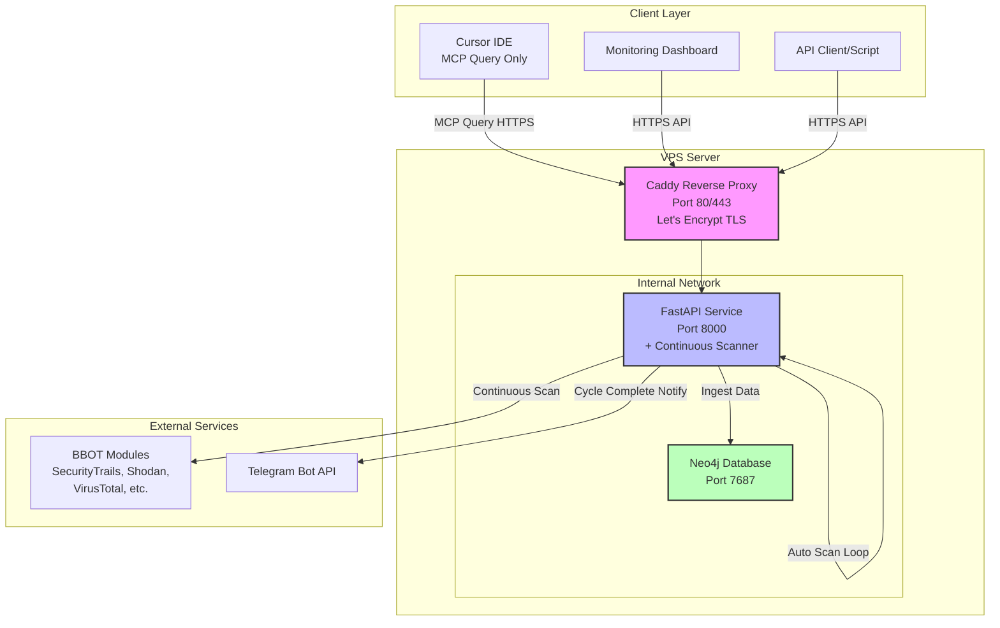
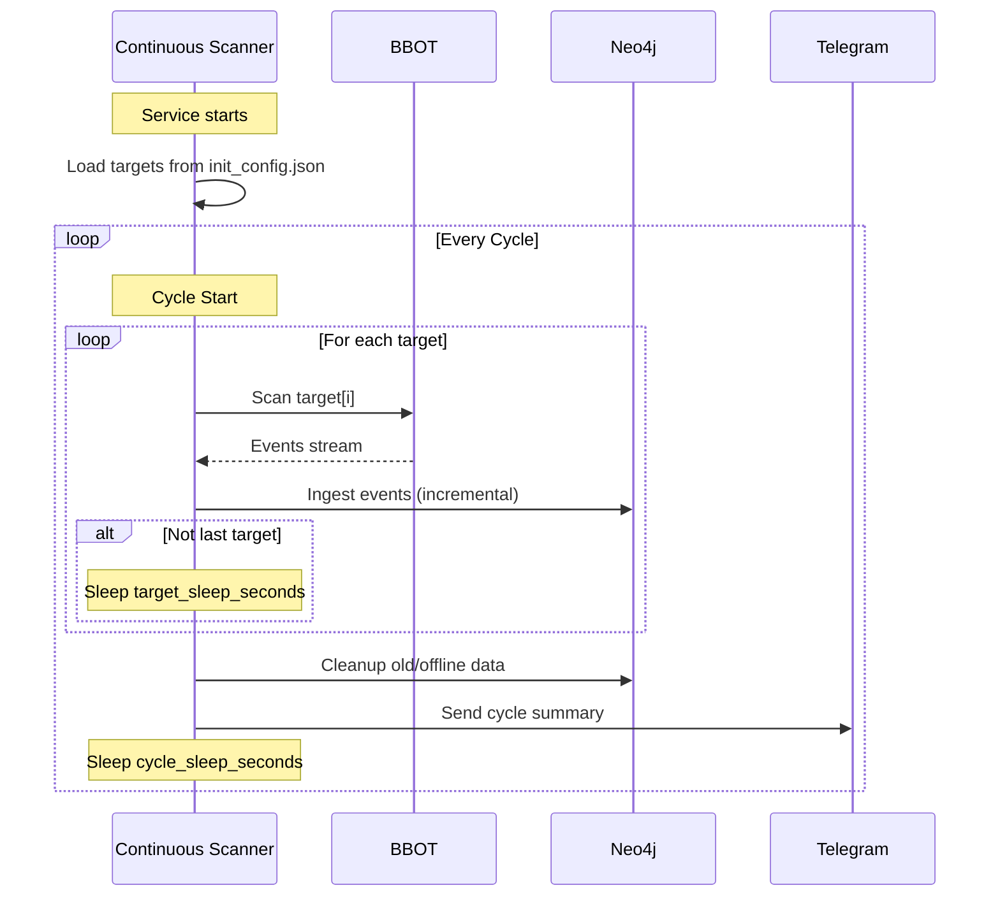
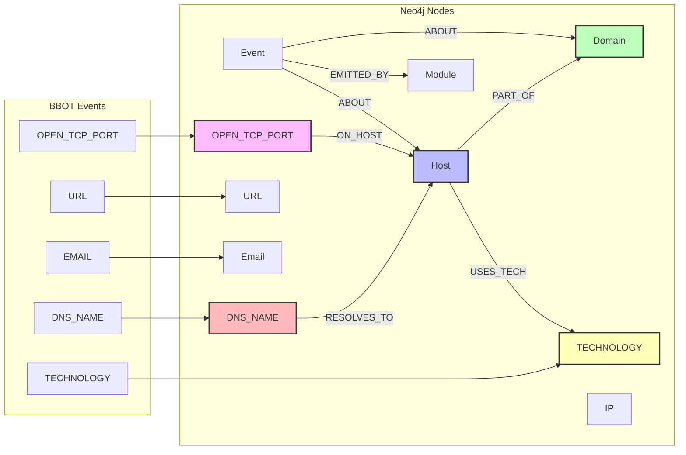

## 1. BBOT OSINT Continuous Monitoring Stack (Docker)

> **Vietnamese version:** [README.md](README.md)

Continuous OSINT monitoring system based on BBOT with FastAPI, Neo4j for full data storage, and MCP server for querying from Cursor.

**GitHub Repository:** [https://github.com/dn9uy3n/bbot-osint-mcp](https://github.com/dn9uy3n/bbot-osint-mcp)

**Documentation:**
- [GitHub BBOT](https://github.com/blacklanternsecurity/bbot)
- **[📝 init_config.json Configuration Guide](docs/INIT_CONFIG_GUIDE.md)** ⭐
- [Detailed Installation Guide](docs/INSTALLATION.md)
- [API Usage Guide](docs/API_USAGE.md)
- [Cursor MCP Integration](docs/MCP_INTEGRATION.md)
- [Data Model](docs/DATA_MODEL.md)
- [Importer (output.json)](docs/IMPORTER.md)
- [Distributed Workers (multi-VPS)](docs/DISTRIBUTED.md)
- [Sleep Parameters Explained](SLEEP_PARAMETERS.md)
- [Troubleshooting](docs/TROUBLESHOOTING.md)
- [Management & Uninstall Guide](docs/UNINSTALL.md)

### 1.1 Project Description

A **continuous monitoring** system that automatically scans targets in cycles, stores full data in Neo4j (DNS records, open ports, technologies, events), with API and MCP for querying. Optimized for 24/7 operation with low concurrency, reducing risk of being blocked.

### 1.2 Key Features

- **Automatic Continuous Scanning**: Automatically scans all configured targets in cycles, no manual triggering needed.
- **2 Types of Sleep Time**:
  - `target_sleep_seconds`: Rest between each target within same cycle (avoid continuous scanning).
  - `cycle_sleep_seconds`: Rest after scanning all targets before starting new cycle.
- **Full Data Fidelity**: Store complete BBOT data in Neo4j (DNS_NAME, OPEN_TCP_PORT, TECHNOLOGY, Event raw data).
- **Incremental Updates**: Subsequent scans only update/add new data, never delete old data (except cleanup by retention policy).
- **MCP Query Interface**: Cursor can connect via MCP to query data (`/mcp/tools/osint.query`, `/mcp/tools/osint.events.query`, `/mcp/tools/osint.status`).
- **REST API**: Query hosts and events via HTTP API.
- **Automatic Cleanup**: Delete expired events, long-offline hosts, and orphan nodes after each cycle.
- **Telegram Notifications**: Notification after each completed scan cycle.
- **Centralized Configuration**: All configuration in `init_config.json` (targets, API keys, sleep times).
- **Distributed Workers**: Multiple BBOT workers can push results through `/ingest/output` with per-worker tokens; workers can auto-upload immediately after each scan.

### 1.3 Architecture

- `docker-compose.yml`: Neo4j and OSINT service (FastAPI + MCP).
- `init_config.json`: input configuration (targets, API keys, Telegram, scan parameters).
- `services/osint`: API, BBOT runner, MCP server source code.
- `reverse-proxy/Caddyfile`: Caddy configuration with automatic Let's Encrypt.

#### Architecture Diagram



#### Continuous Monitoring Flow



#### Neo4j Data Flow



---

## 2. Step-by-Step Installation Guide

### 2.1 Quick Install (Recommended)

```bash
cd /opt
sudo git clone https://github.com/dn9uy3n/bbot-osint-mcp.git
cd bbot-osint-mcp
chmod +x scripts/quick-install.sh
./scripts/quick-install.sh
```

What it does:
- Ensures Docker daemon has reliable DNS (1.1.1.1, 8.8.8.8)
- Creates runtime dirs: logs, cache, scans, secrets
- Generates secrets if missing
- Builds and starts the stack

Verify:
```bash
sudo docker logs -f bbot_osint
```

### 2.2 Common Preparation (all nodes)

#### 2.2.1 Infrastructure requirements

- Ubuntu 22.04/24.04 VPS (≥2 vCPU, 4 GB RAM recommended)
- `sudo` access
- Central node needs a domain pointing to the server (e.g., `osint.example.com`)
- Open ports according to role:
  - Central: 80/443 for reverse proxy, 8000 optional for direct API
  - Worker: only SSH/API ports required (e.g., 22 and 8000)

#### 2.2.2 Update OS and install Docker

```bash
sudo apt-get update -y && sudo apt-get upgrade -y
sudo apt-get install -y ca-certificates curl gnupg lsb-release git

sudo install -m 0755 -d /etc/apt/keyrings
curl -fsSL https://download.docker.com/linux/ubuntu/gpg \
  | sudo gpg --dearmor -o /etc/apt/keyrings/docker.gpg

echo \
  "deb [arch=$(dpkg --print-architecture) signed-by=/etc/apt/keyrings/docker.gpg] \
   https://download.docker.com/linux/ubuntu $(lsb_release -cs) stable" \
  | sudo tee /etc/apt/sources.list.d/docker.list > /dev/null

sudo apt-get update -y
sudo apt-get install -y docker-ce docker-ce-cli containerd.io \
  docker-buildx-plugin docker-compose-plugin

sudo systemctl enable --now docker
sudo docker --version
sudo docker compose version
```

#### 2.2.3 Clone repository

```bash
cd /opt
sudo git clone https://github.com/your-username/bbot-osint-mcp.git
cd bbot-osint-mcp
sudo chown -R $USER:$USER .
```

#### 2.2.4 Generate secrets

```bash
bash scripts/init-secrets.sh
cat secrets/credentials.txt
```

Keep `API_TOKEN` and `NEO4J_PASSWORD` for later steps.

### 2.3 Deploy the central node (with domain)

#### 2.3.1 Create `.env` for central

```bash
cp .env.example .env
nano .env
```

Required entries:

```env
LE_DOMAIN=osint.example.com
LE_EMAIL=admin@example.com
PUBLIC_BASE_URL=https://osint.example.com
NEO4J_USERNAME=neo4j
RATE_LIMIT_PER_MINUTE=120
MAX_CONCURRENT_SCANS=2
CLEANUP_ENABLED=true
EVENT_RETENTION_DAYS=30
OFFLINE_HOST_RETENTION_DAYS=30
ORPHAN_CLEANUP_ENABLED=true
```

Docker secrets provide `API_TOKEN` and `NEO4J_PASSWORD` automatically. Add Telegram values if you want alerts.

#### 2.3.2 Prepare `init_config.json` for central

```bash
cp init_config.json.example init_config.json
nano init_config.json
```

```json
{
  "targets": ["evilcorp.com", "target2.com"],
  "deployment_role": "central",
  "scan_defaults": {
    "presets": ["subdomain-enum"],
    "flags": ["safe"],
    "max_workers": 2,
    "target_sleep_seconds": 300,
    "cycle_sleep_seconds": 3600
  },
  "bbot_modules": {
    "securitytrails": { "api_key": "YOUR_SECURITYTRAILS_KEY" },
    "shodan_dns": { "api_key": "YOUR_SHODAN_KEY" },
    "virustotal": { "api_key": "YOUR_VIRUSTOTAL_KEY" }
  },
  "workers": [
    { "id": "worker-hcm", "token": "<long-random-token>" },
    { "id": "worker-hn", "token": "<another-token>" }
  ]
}
```

- Each worker token should be ≥64 characters (hex/base64).
- Remove an entry to revoke a worker, then `docker compose restart osint`.

#### 2.3.3 Open firewall & start the stack

```bash
sudo ufw allow 80/tcp
sudo ufw allow 443/tcp
sudo ufw allow 22/tcp
sudo ufw allow 8000/tcp comment 'bbot-osint API (optional)'
sudo ufw enable
sudo ufw status

sudo docker compose up -d --build
sudo docker logs -f bbot_caddy
```

Wait for `certificate obtained successfully` from Caddy to confirm HTTPS.

#### 2.3.4 Smoke-test the central API

```bash
API_TOKEN=$(grep '^API_TOKEN:' secrets/credentials.txt | awk '{print $2}')

curl -s -H "X-API-Token: $API_TOKEN" https://osint.example.com/healthz
curl -s -H "X-API-Token: $API_TOKEN" https://osint.example.com/status
```

Monitor scanner logs:

```bash
sudo docker logs -f bbot_osint
```

### 2.4 Deploy worker nodes (no domain required)

#### 2.4.1 Prepare a minimal `.env`

```bash
cp .env.example .env
nano .env
```

- Leave `LE_DOMAIN` and `LE_EMAIL` blank or comment them out.
- Set `PUBLIC_BASE_URL=http://127.0.0.1:8000` (internal only) if you need callbacks.
- Keep rate-limit/cleanup values so the scheduler behaves consistently.

#### 2.4.2 Configure `init_config.json` for workers

```json
{
  "targets": ["acme.example"],
  "deployment_role": "worker",
  "scan_defaults": {
    "presets": ["subdomain-enum"],
    "flags": ["safe"],
    "max_workers": 2,
    "target_sleep_seconds": 300,
    "cycle_sleep_seconds": 3600
  },
  "central_api": {
    "url": "https://osint.example.com/ingest/output",
    "worker_id": "worker-hcm",
    "worker_token": "<long-random-token>",
    "auto_upload": true,
    "compress": true,
    "verify_tls": true,
    "timeout": 180
  }
}
```

Set `auto_upload` to `false` when you prefer manual CLI pushes.

#### 2.4.3 Start worker container

Workers only need the `osint` service:

```bash
sudo docker compose up -d --build --no-deps osint
sudo docker logs -f bbot_osint
```

Apply resource limits if needed:

```bash
sudo docker update --cpus 1.5 --memory 2g bbot_osint
```

#### 2.4.4 Verify uploads from workers

Look for log entries such as:

```
[INFO] Uploaded 4373 records for acme.example from new scan dirs: [...]
```

On the central host you should see matching `Imported N records` entries tagged with the worker ID.

### 2.5 Critical scan parameters

1. **targets**: list of domains processed in order.
2. **target_sleep_seconds** (default 300): pause between targets.
3. **cycle_sleep_seconds** (default 3600): pause between full scan cycles.

📖 Details: [SLEEP_PARAMETERS.md](SLEEP_PARAMETERS.md)

**workers** (central only): define allowed worker IDs/tokens in `init_config.json`.

**central_api** (worker only): define endpoint, credentials, TLS/timeout behaviour.

### 2.6 Typical deployment scenarios

**1. Central-only (no workers)**
- Keep `deployment_role` as `central` (default if omitted).
- Remove or empty the `workers` block to reject remote uploads.
- The built-in scanner runs locally and ingests straight into Neo4j.

**2. Central with managed workers**
- Central: `deployment_role: "central"`, define each worker in `workers` with unique `id/token`.
- Worker: `deployment_role: "worker"`, configure `central_api` with matching credentials and keep `auto_upload` enabled.
- Restrict `/ingest/output` to worker IPs via firewall; rotate/remove tokens to revoke access.

**3. Ad-hoc / manual workers**
- `deployment_role: "worker"`, but set `central_api.auto_upload = false`.
- After each scan, run `python -m app.worker_ingest --file ... --url ... --worker-id ... --worker-token ... --domain ...` when you decide to push data.
- Useful for low-trust environments or manual review before ingesting.

### 2.7 Presets and flags (updated)
- Supported presets: `subdomain-enum`, `spider`, `email-enum`, `web-basic`, `cloud-enum`.
- Supported flags: `safe`, `active`.
- Invalid presets fall back to `subdomain-enum`.
- Invalid flags are silently dropped.
- The image ships with Node.js, JRE, OpenSSL and common Python deps so heavy modules (retirejs, fingerprintx, etc.) can install remaining packages at runtime (container runs as root).

### 2.8 Disable modules via `init_config.json`
Disable unwanted modules (e.g. gowitness screenshots) directly:

```json
"bbot_disable_modules": ["gowitness"]
```

### 2.9 Monitor scan progress

Once the service starts, the continuous scanner runs automatically on both central and worker nodes:

```bash
sudo docker logs -f bbot_osint
sudo docker logs -f bbot_osint 2>&1 | grep -E "Scanning|Sleep|Cycle"
```

Sample output:

```
[INFO] === Starting scan cycle at 2025-10-27 14:30:00 ===
[INFO] [1/2] Scanning target: evilcorp.com
[INFO] ✓ Target evilcorp.com completed: 1247 events
[INFO] Sleeping 300s before next target...
[INFO] [2/2] Scanning target: target2.com
[INFO] ✓ Target target2.com completed: 892 events
[INFO] Running cleanup...
[INFO] === Cycle completed in 1534s, total events: 2139 ===
[INFO] Sleeping 3600s until next cycle...
```

Telegram notifications summarize each completed cycle when configured.

**1. Central-only (no workers)**
- Keep `deployment_role` as `central` (default if omitted).
- Remove the `workers` block or leave it empty to reject remote uploads.
- The built-in scanner will process targets locally and ingest straight into Neo4j.

**2. Central with remote workers**
- Central host: set `deployment_role: "central"`, define each worker inside `workers` with unique `id/token` pairs.
- Worker hosts: set `deployment_role: "worker"`, fill in `central_api` with the matching `worker_id/worker_token`, and keep `auto_upload` enabled to push `output.json` immediately after each target.
- Restrict `/ingest/output` to trusted IPs via firewall; rotate or remove entries from `workers` to revoke access.

**3. Ad-hoc / manual workers**
- Configure `deployment_role: "worker"` but set `central_api.auto_upload = false`.
- After each scan finishes, run `python -m app.worker_ingest --file ... --url ... --worker-id ... --worker-token ... --domain ...` whenever you choose to send results.
- Useful for controlled pushes or in environments where automated uploads are not desired.

#### Presets and Flags (Updated)
- Supported presets: `subdomain-enum`, `spider`, `email-enum`, `web-basic`, `cloud-enum`.
- Supported flags: `safe`, `active`.
- Any invalid preset will be ignored and default to `subdomain-enum`.
- Any invalid flag (e.g., mistakenly adding a preset into flags) will be dropped automatically.
- Runtime dependency installs are disabled in container; modules requiring root installs will be skipped.
  - If you need heavy modules (retirejs, trufflehog, fingerprintx, sslcert, gowitness), the image now preinstalls Node.js, JRE, openssl, and common Python deps. Remaining missing deps will be installed at runtime (container runs as root).

#### Disable Modules from init_config.json
You can disable modules you don't need (e.g., gowitness on servers without headless browser):
```json
"bbot_disable_modules": ["gowitness"]
```

### Step 6: Verify DNS and Firewall

```bash
# Check DNS points correctly
dig +short osint.example.com
# Should return your VPS IP

# Check firewall (Ubuntu UFW)
# REQUIRED when using reverse proxy (Caddy): open 80,443
sudo ufw allow 80/tcp
sudo ufw allow 443/tcp
sudo ufw allow 22/tcp

# Optional: if you access API/MCP directly via IP:8000 (without domain/Caddy)
# you must also open 8000/tcp. Note: the API requires X-API-Token, but the port will be public.
sudo ufw allow 8000/tcp comment 'bbot-osint API/MCP'

sudo ufw enable
sudo ufw status
```

### Step 7: Start the Stack

```bash
# Build and start containers
sudo docker compose up -d --build

# Monitor logs
sudo docker logs -f bbot_caddy
```

**Caddy will automatically:**
- Request certificate from Let's Encrypt
- Configure HTTPS automatically
- Redirect HTTP → HTTPS

When you see log `certificate obtained successfully`, it's successful.

### Step 8: Verify Service

```bash
# Get API_TOKEN
API_TOKEN=$(grep '^API_TOKEN:' secrets/credentials.txt | awk '{print $2}')

# Test healthcheck
curl -s -H "X-API-Token: $API_TOKEN" "https://osint.example.com/healthz"
# Result: {"status":"ok"}
```

### Step 9: Scans run automatically

There is no manual scan endpoint. The scanner reads `init_config.json` and runs cycles continuously.

### Access Neo4j via SSH Tunnel (No Public Exposure)

Neo4j ports are published locally on the VPS: 127.0.0.1:7474 (HTTP) and 127.0.0.1:7687 (Bolt). Access securely from your local machine via SSH tunnels (no socat needed):

```bash
ssh -N -L 7474:127.0.0.1:7474 -L 7687:127.0.0.1:7687 user@VPS_IP
```

Then open: `http://localhost:7474` (Bolt: `bolt://localhost:7687`)
Username: `neo4j`; Password: from `secrets/neo4j_password`.

**Telegram notification**: If configured, you'll receive a message when scan completes.

---

## 3. Detailed Cleanup Explanation

### How Does Cleanup Work?

**Cleanup DOES NOT delete all data**, only removes:

1. **Expired Events**: Events older than `EVENT_RETENTION_DAYS` (default 30 days)
   - Example: Event scans from 31 days ago will be deleted
   - **Important data like Host, Domain are still kept**

2. **Expired Offline Hosts**: Hosts with `status=offline` and `last_seen_ts` older than `OFFLINE_HOST_RETENTION_DAYS`
   - Only deletes hosts that have been offline too long
   - Online hosts or recently offline hosts are kept

3. **Orphan nodes**: Nodes with no relationships
   - Example: Module not linked to any Event
   - Helps keep database clean

### Cleanup Configuration

In `.env`:

```env
# Enable/disable cleanup
CLEANUP_ENABLED=true

# Keep events for 30 days
EVENT_RETENTION_DAYS=30

# Delete offline hosts after 30 days
OFFLINE_HOST_RETENTION_DAYS=30

# Delete orphan nodes
ORPHAN_CLEANUP_ENABLED=true
```

**Important Note:**
- **Online** hosts and Domains are **NEVER** automatically deleted
- Only deletes "garbage" and old data according to policy
- Cleanup runs after each scan

### Example

Scan 1 (day 1):
- Collected 100 subdomains, 1000 events
- Database: 100 hosts, 1000 events

Scan 2 (day 35):
- Collected 120 new subdomains
- Cleanup deletes: 1000 old events (>30 days), 10 offline hosts (>30 days)
- Database after cleanup: 110 online hosts, 1200 new events

---

## 4. API Usage

### Main Endpoints

**1. Healthcheck**

```bash
curl -H "X-API-Token: $API_TOKEN" "https://osint.example.com/healthz"
```

Removed. Continuous scanning only; configure via `scan_defaults`.

**3. Query Hosts**

```bash
curl -X POST "https://osint.example.com/query" \
  -H "Content-Type: application/json" \
  -H "X-API-Token: $API_TOKEN" \
  -d '{
    "domain": "evilcorp.com",
    "online_only": true,
    "limit": 100
  }'
```

**4. Query Events (Full Fidelity)**

```bash
curl -X POST "https://osint.example.com/events/query" \
  -H "Content-Type: application/json" \
  -H "X-API-Token: $API_TOKEN" \
  -d '{
    "types": ["DNS_NAME", "URL"],
    "modules": ["subfinder", "httpx"],
    "domain": "evilcorp.com",
    "since_ts": 1729000000,
    "limit": 200
  }'
```

**5. Manual Upsert**

```bash
curl -X POST "https://osint.example.com/upsert" \
  -H "Content-Type: application/json" \
  -H "X-API-Token: $API_TOKEN" \
  -d '{
    "domain": "evilcorp.com",
    "host": "www.evilcorp.com",
    "status": "online",
    "last_seen_ts": 1730000000,
    "sources": ["manual"],
    "ports": [80, 443]
  }'
```

---

## 5. Cursor Integration (MCP Client)

### Step 1: Install MCP in Cursor

1. Open Cursor Settings
2. Find MCP configuration section
3. Add server configuration:

```json
{
  "mcpServers": {
    "bbot-osint": {
      "type": "http",
      "url": "http://osint.example.com/mcp",
      "headers": {
        "X-API-Token": "YOUR_API_TOKEN_FROM_SECRETS"
      }
    }
  }
}
```

### Step 2: Restart MCP Client

In Cursor:
1. Command Palette (Ctrl+Shift+P / Cmd+Shift+P)
2. Type "MCP: Restart"
3. Select "MCP: Restart Client"

### Step 3: Use Tools

You'll see 2 tools:

1. **osint.query**: Query hosts from Neo4j
2. **osint.events.query**: Query detailed events
3. **osint.status**: Scanner status/config

**Example in Cursor chat:**

```
Call MCP tool: osint.query {"domain":"evilcorp.com","online_only":true}
```

or

Presets: supported values are `subdomain-enum`, `spider`, `email-enum`, `web-basic`, `cloud-enum`. Invalid presets will be ignored and default to `subdomain-enum`.

---

## 6. Neo4j Data Model

### Nodes

- `Domain {name}`: Main domain
- `Host {fqdn, status, last_seen_ts, sources, ports}`: Subdomain/host
- `IP {addr}`: IP addresses
- `URL {value}`: URLs
- `Email {value}`: Email addresses
- `DNS_NAME {name, last_seen_ts}`: DNS records from BBOT
- `OPEN_TCP_PORT {endpoint, port, host, last_seen_ts}`: Open ports (e.g., `example.com:443`)
- `TECHNOLOGY {name}`: Detected technologies (e.g., `nginx`, `PHP`, `WordPress`)
- `Module {name}`: BBOT modules
- `Event {id, type, ts, raw}`: Events from BBOT (stores full raw data)

### Relationships

- `(:Host)-[:PART_OF]->(:Domain)`: Host belongs to domain
- `(:DNS_NAME)-[:RESOLVES_TO]->(:Host)`: DNS name resolves to host
- `(:OPEN_TCP_PORT)-[:ON_HOST]->(:Host)`: Port open on which host
- `(:Host)-[:USES_TECH]->(:TECHNOLOGY)`: Host uses which technology
- `(:Event)-[:ABOUT]->(:Domain|:Host|:IP|:URL|:Email|:DNS_NAME|:OPEN_TCP_PORT|:TECHNOLOGY)`: Event about which entity
- `(:Event)-[:EMITTED_BY]->(:Module)`: Event from which module

### Querying Neo4j

Access Neo4j Browser securely via SSH Tunnel (no public exposure):

1) On VPS, start local-only forwarders to the `neo4j` container:
```bash
sudo docker run -d --rm --name neo4j-forward-7474 \
  --network bbot-osint-mcp_internal \
  -p 127.0.0.1:7474:7474 \
  alpine/socat tcp-l:7474,fork,reuseaddr tcp:bbot_neo4j:7474

sudo docker run -d --rm --name neo4j-forward-7687 \
  --network bbot-osint-mcp_internal \
  -p 127.0.0.1:7687:7687 \
  alpine/socat tcp-l:7687,fork,reuseaddr tcp:bbot_neo4j:7687
```

2) From local machine, create tunnels:
```bash
ssh -L 7474:127.0.0.1:7474 -L 7687:127.0.0.1:7687 user@VPS_IP
```

3) Open: `http://localhost:7474` (Bolt: `bolt://localhost:7687`)
Username: `neo4j`, Password: from `secrets/neo4j_password`.

4) Stop forwarders when done:
```bash
sudo docker rm -f neo4j-forward-7474 neo4j-forward-7687
```

**Example queries:**

```cypher
// Find all subdomains of evilcorp.com
MATCH (h:Host)-[:PART_OF]->(d:Domain {name: "evilcorp.com"})
WHERE h.status = "online"
RETURN h.fqdn, h.last_seen_ts, h.ports
ORDER BY h.last_seen_ts DESC

// Find all open ports of a domain
MATCH (op:OPEN_TCP_PORT)-[:ON_HOST]->(h:Host)-[:PART_OF]->(d:Domain {name: "evilcorp.com"})
RETURN h.fqdn, op.port, op.last_seen_ts
ORDER BY op.port

// Find technologies in use
MATCH (h:Host)-[:USES_TECH]->(t:TECHNOLOGY)
WHERE h.fqdn CONTAINS "evilcorp.com"
RETURN h.fqdn, collect(t.name) as technologies

// Find DNS records
MATCH (dn:DNS_NAME)-[:RESOLVES_TO]->(h:Host)-[:PART_OF]->(d:Domain {name: "evilcorp.com"})
RETURN dn.name, h.fqdn, dn.last_seen_ts
ORDER BY dn.last_seen_ts DESC

// Find events related to a host
MATCH (ev:Event)-[:ABOUT]->(h:Host {fqdn: "www.evilcorp.com"})
RETURN ev.type, ev.ts, ev.raw
ORDER BY ev.ts DESC
LIMIT 50
```

---

## 7. Security

### Applied Security Measures

1. **API Token**: Required `X-API-Token` header for all endpoints
2. **Docker Secrets**: Credentials stored in Docker secrets, not hardcoded
3. **Internal Network**: Neo4j only exposed on internal Docker network
4. **HTTPS Only**: Caddy automatically redirects HTTP → HTTPS
5. **Container Hardening**: Read-only filesystem, drop capabilities, no-new-privileges
6. **Rate Limiting**: Request limits per IP

### Additional Recommendations

1. **Firewall**: Only open 80/443 publicly, SSH via IP whitelist
2. **VPN**: Access Neo4j and admin via VPN
3. **Monitoring**: Monitor logs and alert on 429/401 spikes
4. **Secrets Rotation**: Rotate API_TOKEN periodically
5. **Backup**: Regular backup of Neo4j data volume

```bash
# Backup Neo4j
sudo docker compose exec neo4j neo4j-admin database dump neo4j \
  --to-path=/data/backups/backup-$(date +%Y%m%d).dump
```

---

## 8. Management and Maintenance

### Pause to Edit Config

When you need to add new targets, update API keys, or change sleep times:

```bash
cd /opt/bbot-osint-mcp

# Stop OSINT service
sudo docker compose stop osint

# Edit config
nano init_config.json

# Start again
sudo docker compose start osint

# View logs
sudo docker logs -f bbot_osint
```

**Or hot reload (no stop needed):**

```bash
# Edit config directly
nano init_config.json

# Restart to apply
sudo docker compose restart osint
```

### Common Operations

```bash
# View logs in realtime
sudo docker logs -f bbot_osint

# View only scanner logs
sudo docker logs -f bbot_osint 2>&1 | grep -E "Scanning|Sleep|Cycle"

# Check status
curl -H "X-API-Token: $(cat secrets/api_token)" \
  https://osint.example.com/status

# Restart services
sudo docker compose restart osint

# Update code
git pull
sudo docker compose up -d --build

# View resource usage
sudo docker stats bbot_osint bbot_neo4j
```

### Backup Data

```bash
# Backup Neo4j volume
mkdir -p ~/backups
sudo docker run --rm \
  -v bbot-osint-mcp_neo4j_data:/data \
  -v ~/backups:/backup \
  ubuntu tar czf /backup/neo4j-$(date +%Y%m%d).tar.gz /data

# Backup config
cp init_config.json ~/backup-init_config.json
cp secrets/credentials.txt ~/backup-credentials.txt
```

**Full details:** [docs/UNINSTALL.md](docs/UNINSTALL.md) (includes pause, edit config, backup, restore)

---

## 9. Uninstall

See detailed guide: **[docs/UNINSTALL.md](docs/UNINSTALL.md)**

### Quick uninstall (remove all)

```bash
cd /opt/bbot-osint-mcp
sudo docker compose down -v
sudo docker rmi bbot-osint-mcp-osint:latest neo4j:5.23.1 caddy:2.8-alpine
cd /opt && sudo rm -rf /opt/bbot-osint-mcp
```

### Or use automated script

```bash
cd /opt/bbot-osint-mcp
chmod +x scripts/uninstall.sh
./scripts/uninstall.sh
```

Script provides 3 options:
1. Complete removal (delete everything)
2. Uninstall but keep data (can reinstall later)
3. Only reset Neo4j database

---

## 10. Troubleshooting

### 1. DNS inside containers fails (Temporary failure in name resolution)

Fix:
1) Use Quick Install to set daemon DNS and restart Docker.
2) Verify inside container:
```bash
sudo docker exec bbot_osint getent hosts publicsuffix.org raw.githubusercontent.com
```
3) If still failing, use different DNS (9.9.9.9, 208.67.222.222) in `/etc/docker/daemon.json` and restart Docker.

See detailed guide: **[docs/TROUBLESHOOTING.md](docs/TROUBLESHOOTING.md)**

### 1. Let's Encrypt Certificate Not Issued

**Check:**
```bash
# DNS pointing correctly?
dig +short osint.example.com

# Firewall allows 80/443?
sudo ufw status

# Caddy logs
sudo docker logs bbot_caddy
```

**Solution:**
- Ensure DNS points to VPS IP
- Turn off Cloudflare proxy (gray cloud) during first certificate request
- Verify ports 80/443 are not blocked

### 2. API Returns 401 Unauthorized

**Cause**: Wrong or missing `X-API-Token`

**Solution:**
```bash
# Check correct token
cat secrets/credentials.txt | grep API_TOKEN

# Test with correct token
curl -H "X-API-Token: $(grep '^API_TOKEN:' secrets/credentials.txt | awk '{print $2}')" \
  "https://osint.example.com/healthz"
```

### 3. Scan Gets Blocked/Rate Limited

**Cause**: Scanning too fast

**Solution:**
- Reduce `max_workers` to 1-2
- Increase `sleep_after_scan_seconds`
- Use API keys for modules (in `init_config.json`)

### 4. Database Full

**Solution:**
- Reduce `EVENT_RETENTION_DAYS` and `OFFLINE_HOST_RETENTION_DAYS`
- Run manual cleanup:

```bash
# Enter container
sudo docker exec -it bbot_osint bash

# Python shell
python3 -c "
from app.repository import cleanup_graph
import time
stats = cleanup_graph(int(time.time()))
print(stats)
"
```

---

## 11. Operational Tips

1. **View realtime logs:**
```bash
sudo docker compose logs -f
```

2. **Restart services:**
```bash
sudo docker compose restart osint
```

3. **Update code:**
```bash
git pull
sudo docker compose up -d --build
```

4. **View Neo4j stats:**
```cypher
// In Neo4j Browser
MATCH (n) RETURN labels(n) as type, count(*) as count
```

5. **Export data:**
```bash
# Query and export JSON
curl -X POST "https://osint.example.com/query" \
  -H "Content-Type: application/json" \
  -H "X-API-Token: $API_TOKEN" \
  -d '{"domain":"evilcorp.com","limit":10000}' \
  | jq '.results' > export.json
```

---

**Happy Deploying!** 🎉

If you encounter issues, please open an issue on GitHub or contact us.
