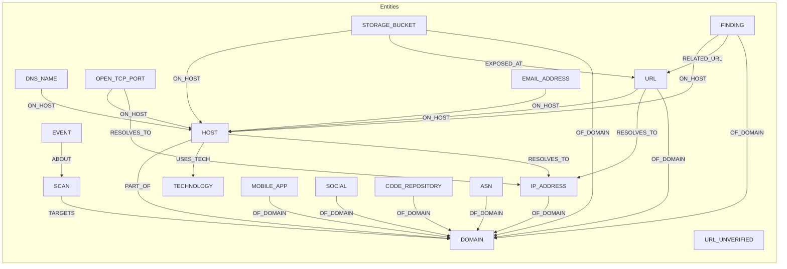

## Data Model (Neo4j)

### Nodes
- DOMAIN {name}
- HOST {name, status?, last_seen_ts?, sources?, ports?}
- DNS_NAME {name, last_seen_ts?}
- OPEN_TCP_PORT {endpoint, port, host?, last_seen_ts?}
- URL {value}
- URL_UNVERIFIED {value}
- EMAIL_ADDRESS {value}
- MOBILE_APP {name}
- TECHNOLOGY {name}
- ASN {number}
- FINDING {id}
- PROTOCOL {name}
- STORAGE_BUCKET {name}
- SOCIAL {handle}
- CODE_REPOSITORY {url}
- IP_ADDRESS {addr}
- SCAN {name}
- EVENT {id, type, raw, tags}

### Relationships (chính)
- (HOST)-[:PART_OF]->(DOMAIN)
- (SCAN)-[:TARGETS]->(DOMAIN)
- (EVENT)-[:ABOUT]->(ANY_ENTITY)

- (DNS_NAME)-[:ON_HOST]->(HOST)
- (OPEN_TCP_PORT)-[:ON_HOST]->(HOST)
- (URL)-[:ON_HOST]->(HOST)
- (EMAIL_ADDRESS)-[:ON_HOST]->(HOST)
- (STORAGE_BUCKET)-[:ON_HOST]->(HOST)
- (FINDING)-[:ON_HOST]->(HOST)
- (PROTOCOL)-[:ON_HOST]->(HOST)
- (SOCIAL)-[:ON_HOST]->(HOST) (tuỳ trường hợp)
- (CODE_REPOSITORY)-[:ON_HOST]->(HOST) (tuỳ trường hợp)

- (HOST)-[:RESOLVES_TO]->(IP_ADDRESS)
- (OPEN_TCP_PORT)-[:RESOLVES_TO]->(IP_ADDRESS)
- (URL)-[:RESOLVES_TO]->(IP_ADDRESS)

- (HOST)-[:USES_TECH]->(TECHNOLOGY)
- (PROTOCOL)-[:ON_PORT]->(OPEN_TCP_PORT)
- (FINDING)-[:RELATED_URL]->(URL)
- (STORAGE_BUCKET)-[:EXPOSED_AT]->(URL)
- (MOBILE_APP)-[:DOWNLOAD_URL]->(URL)

### Relationships (gắn Domain hiện tại)
- (MOBILE_APP|URL|FINDING|PROTOCOL|STORAGE_BUCKET|SOCIAL|CODE_REPOSITORY|EMAIL_ADDRESS|ASN|IP_ADDRESS)
  - [:OF_DOMAIN]->(DOMAIN)

### Truy vấn mẫu
```cypher
// Các host thuộc domain
MATCH (h:Host)-[:PART_OF]->(d:Domain {name:$domain})
RETURN h.fqdn, h.ports

// OPEN_TCP_PORT + IP
MATCH (op:OPEN_TCP_PORT)-[:ON_HOST]->(h:Host)-[:PART_OF]->(d:Domain {name:$domain})
OPTIONAL MATCH (op)-[:RESOLVES_TO]->(i:IP_ADDRESS)
RETURN h.fqdn, op.port, collect(distinct i.addr) AS ips

// URL → IP
MATCH (u:URL)-[:OF_DOMAIN]->(d:Domain {name:$domain})
OPTIONAL MATCH (u)-[:RESOLVES_TO]->(i:IP_ADDRESS)
RETURN u.value, collect(distinct i.addr) AS ips
```

### Mermaid overview



### Query examples

```cypher
// Hosts under a domain
MATCH (h:Host)-[:PART_OF]->(d:Domain {name:$domain})
RETURN h.name, h.ports

// Ports and IPs
MATCH (op:OPEN_TCP_PORT)-[:ON_HOST]->(h:Host)-[:PART_OF]->(d:Domain {name:$domain})
OPTIONAL MATCH (op)-[:RESOLVES_TO]->(i:IP_ADDRESS)
RETURN h.name, op.port, collect(distinct i.addr) AS ips

// URLs and IPs
MATCH (u:URL)-[:OF_DOMAIN]->(d:Domain {name:$domain})
OPTIONAL MATCH (u)-[:RESOLVES_TO]->(i:IP_ADDRESS)
RETURN u.value, collect(distinct i.addr) AS ips

// Latest events
MATCH (ev:EVENT)
RETURN ev.type, ev.id
ORDER BY ev.id DESC LIMIT 20
```

