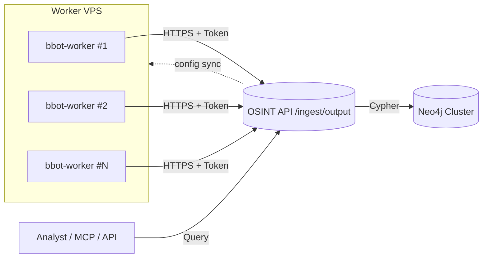

# Phân Tán BBOT Trên Nhiều VPS

Tài liệu này mô tả kiến trúc triển khai nhiều tác nhân quét BBOT (`bbot-osint` worker) trên các VPS riêng biệt và gom kết quả về một máy chủ trung tâm Neo4j/OSINT. Mục tiêu: mở rộng số lượng target, tránh nghẽn tài nguyên, đồng thời vẫn đảm bảo an toàn dữ liệu.

## Kiến Trúc Tổng Quan



- **Central Aggregator**: chạy `docker-compose` mặc định (Neo4j + `osint`). Scanner nội bộ có thể tắt bằng cách đặt `default_targets: []` trong `init_config.json` để tránh xung đột với worker.
- **Worker**: mỗi VPS vận hành 1 container `bbot-worker` (cùng Dockerfile OSINT nhưng bật chế độ worker) thực thi quét BBOT, gửi kết quả `output.json` về `/ingest/output`.
- **Bảo mật**: mỗi worker có cặp `worker_id` + `token` riêng. API xác thực bằng header `X-Worker-Id`/`X-Worker-Token` và chỉ chấp nhận HTTPS.

## Chuẩn Bị Máy Chủ Trung Tâm

1. **Đặt `deployment_role": "central"` và bổ sung block `workers` trong `init_config.json`**:

   ```json
   {
     "targets": ["masterisehomes.com"],
     "deployment_role": "central",
     "scan_defaults": {
       "presets": ["subdomain-enum", "web-basic"],
       "target_sleep_seconds": 300
     },
     "workers": [
       {"id": "worker-hcm", "token": "<chuỗi-ngẫu-nhiên-64-bytes>"},
       {"id": "worker-hn", "token": "<chuỗi-khác>"}
     ]
   }
   ```

   - Token nên dài ≥ 48 ký tự (base64 hoặc hex random).
   - Có thể thêm metadata riêng (ví dụ `note`) nhưng backend chỉ đọc `id` và `token`.

2. **Reload dịch vụ OSINT** để áp dụng cấu hình:

   ```bash
   docker compose up -d --build osint
   ```

3. **Xác nhận**: `docker compose logs -f osint | grep worker` → cần thấy dòng `Loaded N worker tokens from init_config`.

## Cấu Hình Worker VPS

1. Clone repo hoặc chỉ copy thư mục `services/osint`.
2. Chỉnh `init_config.json` trên worker:

   ```json
   {
     "targets": ["masterisehomes.com"],
     "deployment_role": "worker",
     "central_api": {
       "url": "https://osint.example.com/ingest/output",
       "worker_id": "worker-hcm",
       "worker_token": "<chuỗi-ngẫu-nhiên-64-bytes>",
       "auto_upload": true,
       "compress": true,
       "verify_tls": true,
       "timeout": 180
     }
   }
   ```

3. Khởi chạy BBOT tại worker với giới hạn tài nguyên phù hợp (`--cpus`, `--memory`). Có thể dùng Docker riêng hoặc chạy trực tiếp trên VPS. Service sẽ tự động upload `output.json` lên trung tâm sau mỗi target (theo cấu hình trên).

4. Khi cần đẩy thủ công hoặc xử lý lại file cũ, vẫn có thể dùng script `python -m app.worker_ingest ...` để upload.

### Script Upload (CLI mới)

Script `services/osint/app/worker_ingest.py` cung cấp CLI:

```bash
python -m app.worker_ingest \
  --file /root/.bbot/scans/diabolic_carlos/output.json \
  --url https://central.example.com/ingest/output \
  --worker-id worker-hcm \
  --worker-token <token> \
  --domain masterisehomes.com \
  --scan-name diabolic_carlos
```

- File được gzip + base64 trước khi truyền.
- API trả về `{"imported": <số dòng>, "worker": "worker-hcm"}`.

## Lịch Quét & Tránh Xung Đột

- Mỗi worker quản lý danh sách target riêng → không trùng lặp.
- Nếu cần quét chung, thiết lập cơ chế phân lô (batch) hoặc sử dụng queue (RabbitMQ/Redis). Hiện tại yêu cầu tối thiểu yêu cầu phân chia target thủ công.
- Neo4j sử dụng `MERGE` với constraint nên an toàn khi nhiều worker đẩy dữ liệu đồng thời.
- Tất cả worker nên dùng preset/spider depth tối ưu để tránh OOM.

## Checklist Bảo Mật

- **HTTPS**: đảm bảo reverse proxy (Caddy/Nginx) bật TLS, không cho phép HTTP plain.
- **Token dài** (>= 48 ký tự, random).
- **Firewall**: chỉ mở port 443 từ IP worker.
- **Rotate Token**: khi nghi ngờ lộ, sửa block `workers` trong `init_config.json`, `docker compose restart osint`, cập nhật worker (đối với worker cần cập nhật lại `central_api.worker_token`).
- **Logging**: kiểm tra log API để phát hiện upload bất thường.

## Giới Hạn & Hướng Phát Triển

- Chưa có scheduler phân phối target tự động (cần bổ sung queue để chia target động).
- Chưa có cơ chế retry upload → worker nên tự retry (có thể thêm tính năng trong tương lai).
- Worker hiện dùng CLI thủ công, nên viết thêm daemon (systemd hoặc supervisor) để tự động hóa.

## Tóm tắt kịch bản cấu hình

- **Chỉ trung tâm**: Giữ `deployment_role` mặc định (`central`), bỏ `workers`. Các target được quét nội bộ, dữ liệu import thẳng vào Neo4j.
- **Trung tâm + worker tự động**: Trung tâm định nghĩa `workers`; mỗi worker đặt `deployment_role: "worker"` và `central_api.auto_upload: true`. Sau mỗi target, worker dùng API để đẩy `output.json` (gzip/base64) về trung tâm.
- **Worker thủ công**: Khi muốn kiểm soát thời điểm upload, đặt `central_api.auto_upload: false` rồi dùng CLI `python -m app.worker_ingest` để gửi file khi cần.


